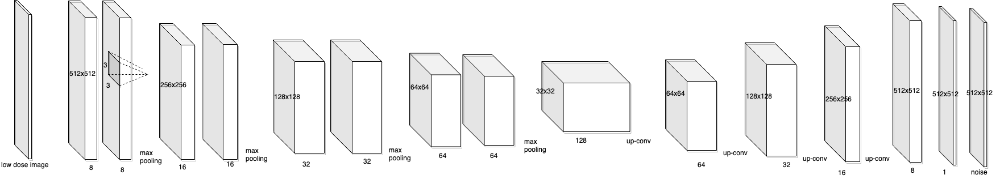
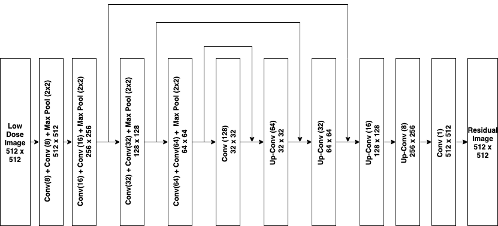

#### UNet3

- added  cropped images to the training
- added regularization with alpha = 0.0001








##### Avg test PSNR

| low dose data | python                          | matlab                                   |
| ------------- | ------------------------------- | ---------------------------------------- |
| Sparseview_60 | Average PSNR 32.11              | Avg PSNR: 30.60	Avg SSIM: 0.8234      |
| Sparseview_90 | --- Average test PSNR 34.45 --- | Avg test PSNR: 33.56	Avg SSIM: 0.8507 |

##### Sparseview_60 final results 

```{python}
I0819 19:22:29.167978 140524826326848 saver.py:1280] Restoring parameters from ./checkpoints/UNet-tensorflow-49
 [*] Load weights SUCCESS...
[*] start testing...
2019-08-19 19:22:30.070664: I tensorflow/stream_executor/platform/default/dso_loader.cc:42] Successfully opened dynamic library libcudnn.so.7
img0 PSNR: 35.55
img1 PSNR: 30.29
img2 PSNR: 35.21
img3 PSNR: 36.00
img4 PSNR: 30.00
img5 PSNR: 30.29
img6 PSNR: 36.36
img7 PSNR: 33.79
img8 PSNR: 32.74
img9 PSNR: 32.47
img10 PSNR: 30.61
img11 PSNR: 32.45
img12 PSNR: 28.79
img13 PSNR: 30.86
img14 PSNR: 31.07
img15 PSNR: 30.41
img16 PSNR: 29.72
img17 PSNR: 32.10
img18 PSNR: 31.81
img19 PSNR: 30.48
img20 PSNR: 31.57
img21 PSNR: 31.01
img22 PSNR: 30.26
img23 PSNR: 30.11
img24 PSNR: 32.75
img25 PSNR: 31.88
img26 PSNR: 31.94
img27 PSNR: 32.05
img28 PSNR: 32.08
img29 PSNR: 32.35
img30 PSNR: 31.17
img31 PSNR: 31.31
img32 PSNR: 30.96
img33 PSNR: 32.29
img34 PSNR: 32.07
img35 PSNR: 32.14
img36 PSNR: 31.27
img37 PSNR: 31.63
img38 PSNR: 30.66
img39 PSNR: 32.03
img40 PSNR: 31.68
img41 PSNR: 32.39
img42 PSNR: 33.96
img43 PSNR: 31.59
img44 PSNR: 32.02
img45 PSNR: 30.82
img46 PSNR: 31.64
img47 PSNR: 34.47
img48 PSNR: 30.48
img49 PSNR: 30.75
img50 PSNR: 34.65
img51 PSNR: 30.21
img52 PSNR: 31.85
img53 PSNR: 30.40
img54 PSNR: 30.62
img55 PSNR: 30.66
img56 PSNR: 32.31
img57 PSNR: 33.30
img58 PSNR: 32.84
img59 PSNR: 33.14
img60 PSNR: 32.79
img61 PSNR: 32.05
img62 PSNR: 31.43
img63 PSNR: 29.41
img64 PSNR: 34.79
img65 PSNR: 34.94
img66 PSNR: 29.35
img67 PSNR: 31.74
img68 PSNR: 35.13
img69 PSNR: 34.29
img70 PSNR: 33.46
img71 PSNR: 31.61
img72 PSNR: 33.00
img73 PSNR: 33.17
img74 PSNR: 29.64
img75 PSNR: 32.48
img76 PSNR: 30.42
img77 PSNR: 34.45
img78 PSNR: 33.83
img79 PSNR: 34.22
img80 PSNR: 32.20
img81 PSNR: 32.09
img82 PSNR: 30.75
img83 PSNR: 31.98
img84 PSNR: 30.35
img85 PSNR: 31.81
img86 PSNR: 34.35
img87 PSNR: 30.51
img88 PSNR: 34.73
img89 PSNR: 31.82
img90 PSNR: 31.93
img91 PSNR: 30.13
img92 PSNR: 34.41
img93 PSNR: 31.16
img94 PSNR: 30.74
img95 PSNR: 34.14
img96 PSNR: 30.26
img97 PSNR: 33.15
img98 PSNR: 31.69
img99 PSNR: 30.87
img100 PSNR: 31.90
img101 PSNR: 30.00
img102 PSNR: 31.58
img103 PSNR: 29.40
img104 PSNR: 32.08
img105 PSNR: 32.81
img106 PSNR: 33.37
img107 PSNR: 29.82
img108 PSNR: 31.90
img109 PSNR: 30.00
img110 PSNR: 29.59
img111 PSNR: 31.29
img112 PSNR: 30.67
img113 PSNR: 32.65
img114 PSNR: 30.00
img115 PSNR: 32.52
img116 PSNR: 30.98
img117 PSNR: 32.56
img118 PSNR: 31.19
img119 PSNR: 33.33
img120 PSNR: 33.77
img121 PSNR: 31.59
img122 PSNR: 34.73
img123 PSNR: 30.48
img124 PSNR: 32.23
img125 PSNR: 34.10
img126 PSNR: 32.67
img127 PSNR: 34.04
img128 PSNR: 30.91
img129 PSNR: 32.25
img130 PSNR: 29.87
img131 PSNR: 31.32
img132 PSNR: 30.52
img133 PSNR: 29.86
img134 PSNR: 33.90
img135 PSNR: 30.25
img136 PSNR: 31.51
img137 PSNR: 31.86
img138 PSNR: 30.83
img139 PSNR: 35.54
img140 PSNR: 32.18
img141 PSNR: 35.52
img142 PSNR: 32.04
img143 PSNR: 32.20
img144 PSNR: 31.89
img145 PSNR: 32.47
img146 PSNR: 32.05
img147 PSNR: 30.94
img148 PSNR: 30.27
img149 PSNR: 30.95
img150 PSNR: 30.84
img151 PSNR: 30.83
img152 PSNR: 29.50
img153 PSNR: 31.70
img154 PSNR: 30.95
img155 PSNR: 32.48
img156 PSNR: 31.21
img157 PSNR: 32.85
img158 PSNR: 31.40
img159 PSNR: 31.94
img160 PSNR: 31.38
img161 PSNR: 31.50
img162 PSNR: 30.69
img163 PSNR: 35.35
img164 PSNR: 30.84
img165 PSNR: 30.90
img166 PSNR: 31.77
img167 PSNR: 34.34
img168 PSNR: 30.94
img169 PSNR: 30.38
img170 PSNR: 29.97
img171 PSNR: 30.72
img172 PSNR: 30.08
img173 PSNR: 30.76
img174 PSNR: 30.40
img175 PSNR: 31.72
img176 PSNR: 30.47
img177 PSNR: 30.55
img178 PSNR: 30.86
img179 PSNR: 29.73
img180 PSNR: 31.79
img181 PSNR: 31.73
img182 PSNR: 31.41
img183 PSNR: 30.69
img184 PSNR: 31.07
img185 PSNR: 30.92
img186 PSNR: 30.54
img187 PSNR: 30.43
img188 PSNR: 29.97
img189 PSNR: 30.78
img190 PSNR: 30.85
img191 PSNR: 31.48
img192 PSNR: 31.64
img193 PSNR: 32.95
img194 PSNR: 30.83
img195 PSNR: 31.73
img196 PSNR: 29.10
img197 PSNR: 30.83
img198 PSNR: 31.66
img199 PSNR: 30.89
img200 PSNR: 33.41
img201 PSNR: 31.72
img202 PSNR: 34.99
img203 PSNR: 35.17
img204 PSNR: 31.36
img205 PSNR: 33.76
img206 PSNR: 33.04
img207 PSNR: 30.99
img208 PSNR: 33.58
img209 PSNR: 36.09
img210 PSNR: 33.46
img211 PSNR: 31.27
img212 PSNR: 28.91
img213 PSNR: 34.26
img214 PSNR: 31.60
img215 PSNR: 29.50
img216 PSNR: 33.02
img217 PSNR: 32.93
img218 PSNR: 31.46
img219 PSNR: 35.31
img220 PSNR: 32.10
img221 PSNR: 30.33
img222 PSNR: 30.52
img223 PSNR: 30.04
img224 PSNR: 35.77
img225 PSNR: 30.68
img226 PSNR: 30.89
img227 PSNR: 29.29
img228 PSNR: 31.12
img229 PSNR: 34.93
img230 PSNR: 31.83
img231 PSNR: 35.78
img232 PSNR: 32.56
img233 PSNR: 34.09
img234 PSNR: 32.33
img235 PSNR: 31.46
img236 PSNR: 31.24
img237 PSNR: 30.60
img238 PSNR: 30.93
img239 PSNR: 32.30
img240 PSNR: 31.45
img241 PSNR: 31.76
img242 PSNR: 33.80
img243 PSNR: 31.49
img244 PSNR: 31.13
img245 PSNR: 31.58
img246 PSNR: 32.05
img247 PSNR: 30.29
img248 PSNR: 32.40
img249 PSNR: 30.30
img250 PSNR: 31.75
img251 PSNR: 34.55
img252 PSNR: 31.83
img253 PSNR: 35.10
img254 PSNR: 31.41
img255 PSNR: 29.09
img256 PSNR: 31.62
img257 PSNR: 32.54
img258 PSNR: 32.08
img259 PSNR: 31.01
img260 PSNR: 32.65
img261 PSNR: 30.02
img262 PSNR: 30.33
img263 PSNR: 31.73
img264 PSNR: 30.25
img265 PSNR: 32.03
img266 PSNR: 33.13
img267 PSNR: 34.69
img268 PSNR: 31.73
img269 PSNR: 36.30
img270 PSNR: 32.87
img271 PSNR: 36.83
img272 PSNR: 33.10
img273 PSNR: 33.58
img274 PSNR: 30.38
img275 PSNR: 31.87
img276 PSNR: 31.19
img277 PSNR: 31.25
img278 PSNR: 34.52
img279 PSNR: 32.40
img280 PSNR: 31.40
img281 PSNR: 32.04
img282 PSNR: 31.84
img283 PSNR: 31.38
img284 PSNR: 31.26
img285 PSNR: 29.88
img286 PSNR: 29.67
img287 PSNR: 30.09
img288 PSNR: 30.42
img289 PSNR: 30.21
img290 PSNR: 32.12
img291 PSNR: 31.26
img292 PSNR: 33.96
img293 PSNR: 34.17
img294 PSNR: 32.73
img295 PSNR: 31.34
img296 PSNR: 30.32
img297 PSNR: 32.17
img298 PSNR: 31.64
img299 PSNR: 35.31
img300 PSNR: 34.32
img301 PSNR: 36.77
img302 PSNR: 35.00
img303 PSNR: 37.48
img304 PSNR: 34.49
img305 PSNR: 33.90
img306 PSNR: 34.55
img307 PSNR: 32.54
img308 PSNR: 35.66
img309 PSNR: 32.74
img310 PSNR: 33.71
img311 PSNR: 33.80
img312 PSNR: 37.11
img313 PSNR: 37.39
img314 PSNR: 34.23
img315 PSNR: 33.90
img316 PSNR: 35.65
img317 PSNR: 30.85
img318 PSNR: 32.51
img319 PSNR: 31.06
img320 PSNR: 30.72
img321 PSNR: 35.42
img322 PSNR: 36.14
img323 PSNR: 35.97
img324 PSNR: 35.01
img325 PSNR: 35.96
img326 PSNR: 31.35
img327 PSNR: 31.21
img328 PSNR: 31.67
img329 PSNR: 32.08
img330 PSNR: 33.26
img331 PSNR: 30.46
img332 PSNR: 32.32
img333 PSNR: 33.56
img334 PSNR: 33.63
img335 PSNR: 31.90
img336 PSNR: 30.68
img337 PSNR: 31.92
img338 PSNR: 31.69
img339 PSNR: 33.47
img340 PSNR: 33.81
img341 PSNR: 32.46
img342 PSNR: 30.23
img343 PSNR: 33.24
img344 PSNR: 33.14
img345 PSNR: 32.69
img346 PSNR: 30.31
img347 PSNR: 32.99
img348 PSNR: 31.40
img349 PSNR: 33.74
img350 PSNR: 29.83
img351 PSNR: 32.08
img352 PSNR: 32.85
img353 PSNR: 33.43
--- Average PSNR 32.11 ---
```


##### Sparseview_60

```{python}
Epoch 0: Avg test PSNR: 16.500433475721827
Epoch 1: Avg test PSNR: 24.697550803485445
Epoch 2: Avg test PSNR: 27.649265956468252
Epoch 3: Avg test PSNR: 27.5478748307227
Epoch 4: Avg test PSNR: 27.750205774612922
Epoch 5: Avg test PSNR: 28.484931862913946
Epoch 6: Avg test PSNR: 28.808502132998576

```

Sparse view_60 matlab output

```{python}
>> test
Img #1: PSNR = 36.29	SSIM = 0.9122
Img #2: PSNR = 28.58	SSIM = 0.8084
Img #3: PSNR = 34.92	SSIM = 0.8974
Img #4: PSNR = 36.25	SSIM = 0.9214
Img #5: PSNR = 28.69	SSIM = 0.8075
Img #6: PSNR = 28.04	SSIM = 0.7937
Img #7: PSNR = 36.96	SSIM = 0.9243
Img #8: PSNR = 32.97	SSIM = 0.8839
Img #9: PSNR = 32.20	SSIM = 0.8519
Img #10: PSNR = 31.09	SSIM = 0.8352
Img #11: PSNR = 29.35	SSIM = 0.8019
Img #12: PSNR = 31.92	SSIM = 0.8549
Img #13: PSNR = 28.02	SSIM = 0.8009
Img #14: PSNR = 29.98	SSIM = 0.8308
Img #15: PSNR = 28.17	SSIM = 0.8040
Img #16: PSNR = 28.29	SSIM = 0.8058
Img #17: PSNR = 29.08	SSIM = 0.8191
Img #18: PSNR = 31.75	SSIM = 0.8435
Img #19: PSNR = 29.93	SSIM = 0.8350
Img #20: PSNR = 29.95	SSIM = 0.8364
Img #21: PSNR = 29.42	SSIM = 0.8259
Img #22: PSNR = 29.77	SSIM = 0.8352
Img #23: PSNR = 29.93	SSIM = 0.8348
Img #24: PSNR = 29.71	SSIM = 0.8351
Img #25: PSNR = 29.82	SSIM = 0.8489
Img #26: PSNR = 31.18	SSIM = 0.7877
Img #27: PSNR = 31.99	SSIM = 0.8354
Img #28: PSNR = 31.32	SSIM = 0.8116
Img #29: PSNR = 31.35	SSIM = 0.8022
Img #30: PSNR = 31.55	SSIM = 0.8523
Img #31: PSNR = 30.14	SSIM = 0.7531
Img #32: PSNR = 31.33	SSIM = 0.8700
Img #33: PSNR = 30.24	SSIM = 0.8518
Img #34: PSNR = 31.40	SSIM = 0.8563
Img #35: PSNR = 31.09	SSIM = 0.7921
Img #36: PSNR = 31.56	SSIM = 0.8126
Img #37: PSNR = 31.04	SSIM = 0.7983
Img #38: PSNR = 30.32	SSIM = 0.7847
Img #39: PSNR = 29.95	SSIM = 0.8270
Img #40: PSNR = 30.75	SSIM = 0.7976
Img #41: PSNR = 30.68	SSIM = 0.7980
Img #42: PSNR = 33.77	SSIM = 0.8775
Img #43: PSNR = 30.82	SSIM = 0.8034
Img #44: PSNR = 31.61	SSIM = 0.8059
Img #45: PSNR = 32.01	SSIM = 0.8449
Img #46: PSNR = 30.24	SSIM = 0.8221
Img #47: PSNR = 30.39	SSIM = 0.8262
Img #48: PSNR = 33.02	SSIM = 0.8809
Img #49: PSNR = 29.83	SSIM = 0.8256
Img #50: PSNR = 29.15	SSIM = 0.8033
Img #51: PSNR = 31.64	SSIM = 0.8167
Img #52: PSNR = 28.95	SSIM = 0.8050
Img #53: PSNR = 31.64	SSIM = 0.8480
Img #54: PSNR = 28.72	SSIM = 0.6800
Img #55: PSNR = 29.54	SSIM = 0.7437
Img #56: PSNR = 29.79	SSIM = 0.8382
Img #57: PSNR = 34.48	SSIM = 0.9148
Img #58: PSNR = 28.95	SSIM = 0.8604
Img #59: PSNR = 28.79	SSIM = 0.8569
Img #60: PSNR = 31.08	SSIM = 0.8659
Img #61: PSNR = 31.69	SSIM = 0.8405
Img #62: PSNR = 33.77	SSIM = 0.9083
Img #63: PSNR = 29.41	SSIM = 0.8232
Img #64: PSNR = 27.66	SSIM = 0.7778
Img #65: PSNR = 31.17	SSIM = 0.8465
Img #66: PSNR = 31.36	SSIM = 0.8532
Img #67: PSNR = 28.15	SSIM = 0.7766
Img #68: PSNR = 29.88	SSIM = 0.7961
Img #69: PSNR = 32.67	SSIM = 0.8689
Img #70: PSNR = 30.18	SSIM = 0.8507
Img #71: PSNR = 30.14	SSIM = 0.8499
Img #72: PSNR = 30.01	SSIM = 0.8368
Img #73: PSNR = 31.43	SSIM = 0.8320
Img #74: PSNR = 29.56	SSIM = 0.8403
Img #75: PSNR = 29.12	SSIM = 0.8064
Img #76: PSNR = 30.68	SSIM = 0.8116
Img #77: PSNR = 28.59	SSIM = 0.8075
Img #78: PSNR = 34.31	SSIM = 0.8802
Img #79: PSNR = 27.41	SSIM = 0.7848
Img #80: PSNR = 35.30	SSIM = 0.9127
Img #81: PSNR = 31.03	SSIM = 0.7873
Img #82: PSNR = 31.67	SSIM = 0.7948
Img #83: PSNR = 30.27	SSIM = 0.8179
Img #84: PSNR = 30.62	SSIM = 0.8161
Img #85: PSNR = 28.97	SSIM = 0.8144
Img #86: PSNR = 29.09	SSIM = 0.7625
Img #87: PSNR = 30.47	SSIM = 0.8502
Img #88: PSNR = 29.74	SSIM = 0.7833
Img #89: PSNR = 34.16	SSIM = 0.8883
Img #90: PSNR = 31.24	SSIM = 0.8267
Img #91: PSNR = 30.34	SSIM = 0.8430
Img #92: PSNR = 29.29	SSIM = 0.8313
Img #93: PSNR = 35.25	SSIM = 0.9273
Img #94: PSNR = 30.11	SSIM = 0.8065
Img #95: PSNR = 29.09	SSIM = 0.8266
Img #96: PSNR = 32.57	SSIM = 0.8793
Img #97: PSNR = 29.14	SSIM = 0.7735
Img #98: PSNR = 27.64	SSIM = 0.7733
Img #99: PSNR = 31.37	SSIM = 0.8264
Img #100: PSNR = 28.61	SSIM = 0.7534
Img #101: PSNR = 30.06	SSIM = 0.7992
Img #102: PSNR = 29.69	SSIM = 0.8521
Img #103: PSNR = 30.35	SSIM = 0.7988
Img #104: PSNR = 28.49	SSIM = 0.8241
Img #105: PSNR = 31.27	SSIM = 0.8182
Img #106: PSNR = 31.92	SSIM = 0.8405
Img #107: PSNR = 33.88	SSIM = 0.8982
Img #108: PSNR = 28.24	SSIM = 0.8210
Img #109: PSNR = 31.26	SSIM = 0.8264
Img #110: PSNR = 29.17	SSIM = 0.8395
Img #111: PSNR = 28.76	SSIM = 0.8316
Img #112: PSNR = 29.63	SSIM = 0.8421
Img #113: PSNR = 30.78	SSIM = 0.8605
Img #114: PSNR = 32.50	SSIM = 0.8349
Img #115: PSNR = 28.93	SSIM = 0.8077
Img #116: PSNR = 31.24	SSIM = 0.7963
Img #117: PSNR = 27.48	SSIM = 0.7734
Img #118: PSNR = 32.57	SSIM = 0.8414
Img #119: PSNR = 29.90	SSIM = 0.8243
Img #120: PSNR = 32.13	SSIM = 0.8581
Img #121: PSNR = 32.56	SSIM = 0.8529
Img #122: PSNR = 29.58	SSIM = 0.8294
Img #123: PSNR = 29.60	SSIM = 0.8359
Img #124: PSNR = 29.33	SSIM = 0.8157
Img #125: PSNR = 29.12	SSIM = 0.7979
Img #126: PSNR = 32.20	SSIM = 0.8674
Img #127: PSNR = 31.97	SSIM = 0.8621
Img #128: PSNR = 30.86	SSIM = 0.8490
Img #129: PSNR = 29.67	SSIM = 0.8184
Img #130: PSNR = 32.02	SSIM = 0.8454
Img #131: PSNR = 28.01	SSIM = 0.8047
Img #132: PSNR = 30.36	SSIM = 0.7737
Img #133: PSNR = 31.00	SSIM = 0.8401
Img #134: PSNR = 28.64	SSIM = 0.8249
Img #135: PSNR = 28.66	SSIM = 0.7786
Img #136: PSNR = 29.29	SSIM = 0.7392
Img #137: PSNR = 30.26	SSIM = 0.7563
Img #138: PSNR = 29.76	SSIM = 0.7429
Img #139: PSNR = 29.70	SSIM = 0.8032
Img #140: PSNR = 32.35	SSIM = 0.8568
Img #141: PSNR = 30.18	SSIM = 0.7664
Img #142: PSNR = 32.01	SSIM = 0.8515
Img #143: PSNR = 29.55	SSIM = 0.8132
Img #144: PSNR = 29.28	SSIM = 0.8024
Img #145: PSNR = 28.35	SSIM = 0.7845
Img #146: PSNR = 29.76	SSIM = 0.8065
Img #147: PSNR = 29.81	SSIM = 0.8071
Img #148: PSNR = 28.94	SSIM = 0.7911
Img #149: PSNR = 28.97	SSIM = 0.7588
Img #150: PSNR = 28.42	SSIM = 0.7459
Img #151: PSNR = 30.11	SSIM = 0.8098
Img #152: PSNR = 29.63	SSIM = 0.7965
Img #153: PSNR = 27.85	SSIM = 0.7457
Img #154: PSNR = 31.45	SSIM = 0.8108
Img #155: PSNR = 30.37	SSIM = 0.7865
Img #156: PSNR = 31.28	SSIM = 0.7952
Img #157: PSNR = 29.63	SSIM = 0.7744
Img #158: PSNR = 30.39	SSIM = 0.8192
Img #159: PSNR = 30.81	SSIM = 0.7885
Img #160: PSNR = 31.64	SSIM = 0.8382
Img #161: PSNR = 29.93	SSIM = 0.7883
Img #162: PSNR = 30.93	SSIM = 0.8636
Img #163: PSNR = 29.34	SSIM = 0.7961
Img #164: PSNR = 30.96	SSIM = 0.8791
Img #165: PSNR = 29.97	SSIM = 0.7747
Img #166: PSNR = 30.05	SSIM = 0.8200
Img #167: PSNR = 30.47	SSIM = 0.7996
Img #168: PSNR = 28.14	SSIM = 0.8331
Img #169: PSNR = 29.34	SSIM = 0.7602
Img #170: PSNR = 29.34	SSIM = 0.8011
Img #171: PSNR = 28.78	SSIM = 0.7981
Img #172: PSNR = 29.56	SSIM = 0.8193
Img #173: PSNR = 29.31	SSIM = 0.7897
Img #174: PSNR = 30.05	SSIM = 0.8159
Img #175: PSNR = 29.92	SSIM = 0.8264
Img #176: PSNR = 30.47	SSIM = 0.8247
Img #177: PSNR = 29.27	SSIM = 0.7958
Img #178: PSNR = 29.36	SSIM = 0.7870
Img #179: PSNR = 29.71	SSIM = 0.8516
Img #180: PSNR = 27.63	SSIM = 0.7834
Img #181: PSNR = 30.33	SSIM = 0.8464
Img #182: PSNR = 30.76	SSIM = 0.8258
Img #183: PSNR = 30.25	SSIM = 0.8193
Img #184: PSNR = 29.45	SSIM = 0.8404
Img #185: PSNR = 29.57	SSIM = 0.8046
Img #186: PSNR = 28.80	SSIM = 0.7548
Img #187: PSNR = 28.92	SSIM = 0.7981
Img #188: PSNR = 29.21	SSIM = 0.8045
Img #189: PSNR = 28.30	SSIM = 0.7877
Img #190: PSNR = 29.34	SSIM = 0.8062
Img #191: PSNR = 29.84	SSIM = 0.7737
Img #192: PSNR = 30.76	SSIM = 0.7901
Img #193: PSNR = 31.29	SSIM = 0.8023
Img #194: PSNR = 28.04	SSIM = 0.8192
Img #195: PSNR = 30.21	SSIM = 0.8363
Img #196: PSNR = 31.35	SSIM = 0.8110
Img #197: PSNR = 28.32	SSIM = 0.8098
Img #198: PSNR = 28.56	SSIM = 0.8039
Img #199: PSNR = 30.96	SSIM = 0.7943
Img #200: PSNR = 30.69	SSIM = 0.8428
Img #201: PSNR = 33.76	SSIM = 0.8786
Img #202: PSNR = 29.81	SSIM = 0.8283
Img #203: PSNR = 30.39	SSIM = 0.8744
Img #204: PSNR = 28.48	SSIM = 0.8300
Img #205: PSNR = 30.70	SSIM = 0.8601
Img #206: PSNR = 32.26	SSIM = 0.8490
Img #207: PSNR = 32.57	SSIM = 0.8530
Img #208: PSNR = 30.88	SSIM = 0.8605
Img #209: PSNR = 29.24	SSIM = 0.8201
Img #210: PSNR = 29.71	SSIM = 0.8525
Img #211: PSNR = 29.93	SSIM = 0.8281
Img #212: PSNR = 30.64	SSIM = 0.8376
Img #213: PSNR = 28.01	SSIM = 0.8094
Img #214: PSNR = 33.52	SSIM = 0.8598
Img #215: PSNR = 29.01	SSIM = 0.8220
Img #216: PSNR = 28.14	SSIM = 0.8113
Img #217: PSNR = 26.90	SSIM = 0.8070
Img #218: PSNR = 32.56	SSIM = 0.8299
Img #219: PSNR = 31.89	SSIM = 0.8285
Img #220: PSNR = 32.19	SSIM = 0.8643
Img #221: PSNR = 30.80	SSIM = 0.7928
Img #222: PSNR = 29.01	SSIM = 0.8050
Img #223: PSNR = 28.41	SSIM = 0.8004
Img #224: PSNR = 29.38	SSIM = 0.8142
Img #225: PSNR = 31.39	SSIM = 0.8219
Img #226: PSNR = 29.52	SSIM = 0.7871
Img #227: PSNR = 30.07	SSIM = 0.8286
Img #228: PSNR = 27.52	SSIM = 0.7717
Img #229: PSNR = 28.75	SSIM = 0.8031
Img #230: PSNR = 31.89	SSIM = 0.8371
Img #231: PSNR = 30.91	SSIM = 0.8208
Img #232: PSNR = 36.32	SSIM = 0.9145
Img #233: PSNR = 32.40	SSIM = 0.8494
Img #234: PSNR = 33.49	SSIM = 0.8784
Img #235: PSNR = 29.44	SSIM = 0.8006
Img #236: PSNR = 31.28	SSIM = 0.8386
Img #237: PSNR = 28.01	SSIM = 0.7565
Img #238: PSNR = 29.40	SSIM = 0.7993
Img #239: PSNR = 28.44	SSIM = 0.7500
Img #240: PSNR = 29.38	SSIM = 0.7938
Img #241: PSNR = 31.42	SSIM = 0.8566
Img #242: PSNR = 31.40	SSIM = 0.8613
Img #243: PSNR = 30.71	SSIM = 0.8385
Img #244: PSNR = 31.09	SSIM = 0.8227
Img #245: PSNR = 29.99	SSIM = 0.8023
Img #246: PSNR = 29.19	SSIM = 0.7321
Img #247: PSNR = 28.61	SSIM = 0.7515
Img #248: PSNR = 27.95	SSIM = 0.7546
Img #249: PSNR = 28.58	SSIM = 0.7533
Img #250: PSNR = 29.41	SSIM = 0.7213
Img #251: PSNR = 31.79	SSIM = 0.7727
Img #252: PSNR = 30.84	SSIM = 0.7452
Img #253: PSNR = 30.05	SSIM = 0.7843
Img #254: PSNR = 35.16	SSIM = 0.8730
Img #255: PSNR = 28.71	SSIM = 0.7633
Img #256: PSNR = 28.42	SSIM = 0.7661
Img #257: PSNR = 31.46	SSIM = 0.8332
Img #258: PSNR = 32.00	SSIM = 0.8333
Img #259: PSNR = 30.57	SSIM = 0.8206
Img #260: PSNR = 30.56	SSIM = 0.7301
Img #261: PSNR = 31.38	SSIM = 0.8167
Img #262: PSNR = 28.53	SSIM = 0.7151
Img #263: PSNR = 29.25	SSIM = 0.7617
Img #264: PSNR = 29.69	SSIM = 0.7993
Img #265: PSNR = 29.04	SSIM = 0.7123
Img #266: PSNR = 30.59	SSIM = 0.8252
Img #267: PSNR = 31.15	SSIM = 0.8148
Img #268: PSNR = 28.88	SSIM = 0.8438
Img #269: PSNR = 30.18	SSIM = 0.8374
Img #270: PSNR = 29.69	SSIM = 0.8462
Img #271: PSNR = 31.87	SSIM = 0.8656
Img #272: PSNR = 36.94	SSIM = 0.9275
Img #273: PSNR = 33.11	SSIM = 0.8558
Img #274: PSNR = 32.78	SSIM = 0.8853
Img #275: PSNR = 29.12	SSIM = 0.8280
Img #276: PSNR = 30.45	SSIM = 0.8125
Img #277: PSNR = 29.04	SSIM = 0.8267
Img #278: PSNR = 29.83	SSIM = 0.8345
Img #279: PSNR = 28.05	SSIM = 0.7978
Img #280: PSNR = 31.71	SSIM = 0.8386
Img #281: PSNR = 28.01	SSIM = 0.7890
Img #282: PSNR = 30.08	SSIM = 0.8247
Img #283: PSNR = 30.08	SSIM = 0.8223
Img #284: PSNR = 31.09	SSIM = 0.8291
Img #285: PSNR = 29.60	SSIM = 0.8195
Img #286: PSNR = 29.18	SSIM = 0.8161
Img #287: PSNR = 28.28	SSIM = 0.7980
Img #288: PSNR = 29.08	SSIM = 0.8092
Img #289: PSNR = 27.74	SSIM = 0.6786
Img #290: PSNR = 29.47	SSIM = 0.8122
Img #291: PSNR = 30.32	SSIM = 0.8109
Img #292: PSNR = 29.94	SSIM = 0.8191
Img #293: PSNR = 30.46	SSIM = 0.8602
Img #294: PSNR = 27.88	SSIM = 0.8288
Img #295: PSNR = 32.71	SSIM = 0.8497
Img #296: PSNR = 29.63	SSIM = 0.8339
Img #297: PSNR = 28.93	SSIM = 0.7861
Img #298: PSNR = 32.07	SSIM = 0.8374
Img #299: PSNR = 30.43	SSIM = 0.7797
Img #300: PSNR = 26.85	SSIM = 0.7978
Img #301: PSNR = 29.25	SSIM = 0.8484
Img #302: PSNR = 36.33	SSIM = 0.9086
Img #303: PSNR = 32.32	SSIM = 0.8566
Img #304: PSNR = 37.05	SSIM = 0.9188
Img #305: PSNR = 33.51	SSIM = 0.8698
Img #306: PSNR = 31.70	SSIM = 0.8436
Img #307: PSNR = 34.33	SSIM = 0.8645
Img #308: PSNR = 30.65	SSIM = 0.8173
Img #309: PSNR = 34.80	SSIM = 0.8928
Img #310: PSNR = 30.51	SSIM = 0.8101
Img #311: PSNR = 32.17	SSIM = 0.8349
Img #312: PSNR = 33.02	SSIM = 0.8539
Img #313: PSNR = 36.46	SSIM = 0.9124
Img #314: PSNR = 37.83	SSIM = 0.9274
Img #315: PSNR = 30.85	SSIM = 0.8287
Img #316: PSNR = 33.41	SSIM = 0.8525
Img #317: PSNR = 34.04	SSIM = 0.8862
Img #318: PSNR = 30.18	SSIM = 0.7635
Img #319: PSNR = 34.21	SSIM = 0.9010
Img #320: PSNR = 30.81	SSIM = 0.7723
Img #321: PSNR = 29.00	SSIM = 0.7156
Img #322: PSNR = 34.25	SSIM = 0.8963
Img #323: PSNR = 31.69	SSIM = 0.8529
Img #324: PSNR = 31.81	SSIM = 0.8587
Img #325: PSNR = 31.73	SSIM = 0.8680
Img #326: PSNR = 34.34	SSIM = 0.9124
Img #327: PSNR = 30.40	SSIM = 0.8066
Img #328: PSNR = 29.60	SSIM = 0.8457
Img #329: PSNR = 30.85	SSIM = 0.8240
Img #330: PSNR = 31.48	SSIM = 0.8523
Img #331: PSNR = 31.64	SSIM = 0.8681
Img #332: PSNR = 28.97	SSIM = 0.8325
Img #333: PSNR = 31.94	SSIM = 0.8547
Img #334: PSNR = 31.77	SSIM = 0.8328
Img #335: PSNR = 34.07	SSIM = 0.8876
Img #336: PSNR = 29.57	SSIM = 0.8486
Img #337: PSNR = 28.83	SSIM = 0.8306
Img #338: PSNR = 31.52	SSIM = 0.8535
Img #339: PSNR = 30.67	SSIM = 0.8253
Img #340: PSNR = 32.87	SSIM = 0.8371
Img #341: PSNR = 31.49	SSIM = 0.8465
Img #342: PSNR = 31.30	SSIM = 0.8203
Img #343: PSNR = 29.85	SSIM = 0.7972
Img #344: PSNR = 32.51	SSIM = 0.9017
Img #345: PSNR = 33.11	SSIM = 0.9131
Img #346: PSNR = 34.65	SSIM = 0.9278
Img #347: PSNR = 29.07	SSIM = 0.8125
Img #348: PSNR = 30.93	SSIM = 0.8245
Img #349: PSNR = 29.59	SSIM = 0.7958
Img #350: PSNR = 35.68	SSIM = 0.9313
Img #351: PSNR = 28.26	SSIM = 0.7942
Img #352: PSNR = 30.72	SSIM = 0.8185
Img #353: PSNR = 31.24	SSIM = 0.8170
Img #354: PSNR = 31.92	SSIM = 0.8320

 Avg PSNR: 30.60	Avg SSIM: 0.8234
>> 
```


##### Spaseview_60

```{python}
Test img 0/354 PSNR: 35.55236805321914

Test img 1/354 PSNR: 30.29299624672909

Test img 2/354 PSNR: 35.20746332567666

Test img 3/354 PSNR: 35.99978869744163

Test img 4/354 PSNR: 30.00298269208443

Test img 5/354 PSNR: 30.2854625055641

Test img 6/354 PSNR: 36.363875764138015

Test img 7/354 PSNR: 33.79324027596308

Test img 8/354 PSNR: 32.73564573583509

Test img 9/354 PSNR: 32.47295466244965

Test img 10/354 PSNR: 30.610648696381773

Test img 11/354 PSNR: 32.45156296098378

Test img 12/354 PSNR: 28.78935823792173

Test img 13/354 PSNR: 30.862718168691114

Test img 14/354 PSNR: 31.073009513544815

Test img 15/354 PSNR: 30.410067959780406

Test img 16/354 PSNR: 29.71521989601412

Test img 17/354 PSNR: 32.09717675239614

Test img 18/354 PSNR: 31.812833178073895

Test img 19/354 PSNR: 30.48134064018678

Test img 20/354 PSNR: 31.57032410550217

Test img 21/354 PSNR: 31.007272918916556

Test img 22/354 PSNR: 30.26033296795026

Test img 23/354 PSNR: 30.112565752641565

Test img 24/354 PSNR: 32.7534254102596

Test img 25/354 PSNR: 31.876723850838857

Test img 26/354 PSNR: 31.943979289407103

Test img 27/354 PSNR: 32.052589992598335

Test img 28/354 PSNR: 32.07579337695756

Test img 29/354 PSNR: 32.34680629511027

Test img 30/354 PSNR: 31.167016104375005

Test img 31/354 PSNR: 31.30787053651074

Test img 32/354 PSNR: 30.959433549604206

Test img 33/354 PSNR: 32.29454189501692

Test img 34/354 PSNR: 32.0674049953739

Test img 35/354 PSNR: 32.13655878234797

Test img 36/354 PSNR: 31.272036508412068

Test img 37/354 PSNR: 31.626295999094598

Test img 38/354 PSNR: 30.660172879960847

Test img 39/354 PSNR: 32.03404449537945

Test img 40/354 PSNR: 31.684927499198334

Test img 41/354 PSNR: 32.39217643922352

Test img 42/354 PSNR: 33.96446869399356

Test img 43/354 PSNR: 31.589310756430233

Test img 44/354 PSNR: 32.01991401856403

Test img 45/354 PSNR: 30.823919897875673

Test img 46/354 PSNR: 31.6388032403323

Test img 47/354 PSNR: 34.46873059077413

Test img 48/354 PSNR: 30.481435204447088

Test img 49/354 PSNR: 30.7516701557927

Test img 50/354 PSNR: 34.65090621215924

Test img 51/354 PSNR: 30.205452458938847

Test img 52/354 PSNR: 31.84853959780224

Test img 53/354 PSNR: 30.395913452516105

Test img 54/354 PSNR: 30.617963649273847

Test img 55/354 PSNR: 30.661432474255797

Test img 56/354 PSNR: 32.30502490427503

Test img 57/354 PSNR: 33.29552037557673

Test img 58/354 PSNR: 32.84034462950096

Test img 59/354 PSNR: 33.13821739729613

Test img 60/354 PSNR: 32.78633317068243

Test img 61/354 PSNR: 32.04507535583631

Test img 62/354 PSNR: 31.434083453299934

Test img 63/354 PSNR: 29.410262568162526

Test img 64/354 PSNR: 34.788310679111305

Test img 65/354 PSNR: 34.939134713025446

Test img 66/354 PSNR: 29.352817573004284

Test img 67/354 PSNR: 31.738866414993335

Test img 68/354 PSNR: 35.12756584811952

Test img 69/354 PSNR: 34.290773778792854

Test img 70/354 PSNR: 33.46332036269999

Test img 71/354 PSNR: 31.606038685625894

Test img 72/354 PSNR: 32.99923357214598

Test img 73/354 PSNR: 33.16661512034712

Test img 74/354 PSNR: 29.638224248125084

Test img 75/354 PSNR: 32.47756601471712

Test img 76/354 PSNR: 30.41677017990855

Test img 77/354 PSNR: 34.44967999164095

Test img 78/354 PSNR: 33.82886439713832

Test img 79/354 PSNR: 34.224745397020165

Test img 80/354 PSNR: 32.19918884303525

Test img 81/354 PSNR: 32.08636545279673

Test img 82/354 PSNR: 30.750351247648105

Test img 83/354 PSNR: 31.981502401423715

Test img 84/354 PSNR: 30.349559746784678

Test img 85/354 PSNR: 31.807703137848332

Test img 86/354 PSNR: 34.34674485391582

Test img 87/354 PSNR: 30.50851332855086

Test img 88/354 PSNR: 34.73025072471295

Test img 89/354 PSNR: 31.820570052339804

Test img 90/354 PSNR: 31.928660657890685

Test img 91/354 PSNR: 30.130072533150248

Test img 92/354 PSNR: 34.409185085082726

Test img 93/354 PSNR: 31.15585911478567

Test img 94/354 PSNR: 30.744777084120017

Test img 95/354 PSNR: 34.13957675369537

Test img 96/354 PSNR: 30.258161017739987

Test img 97/354 PSNR: 33.15034768650297

Test img 98/354 PSNR: 31.686858116315264

Test img 99/354 PSNR: 30.867307650662053

Test img 100/354 PSNR: 31.896890460865155

Test img 101/354 PSNR: 29.99967173351306

Test img 102/354 PSNR: 31.577393459975998

Test img 103/354 PSNR: 29.403353353853166

Test img 104/354 PSNR: 32.07502311104057

Test img 105/354 PSNR: 32.808491453287076

Test img 106/354 PSNR: 33.366106523098644

Test img 107/354 PSNR: 29.819307095777482

Test img 108/354 PSNR: 31.89795376950486

Test img 109/354 PSNR: 29.99961344645461

Test img 110/354 PSNR: 29.588745441149797

Test img 111/354 PSNR: 31.293968523567944

Test img 112/354 PSNR: 30.667138693992875

Test img 113/354 PSNR: 32.64783577470773

Test img 114/354 PSNR: 30.003105055533055

Test img 115/354 PSNR: 32.519934752972716

Test img 116/354 PSNR: 30.98460493926298

Test img 117/354 PSNR: 32.55818265539919

Test img 118/354 PSNR: 31.189385935155588

Test img 119/354 PSNR: 33.32866378769775

Test img 120/354 PSNR: 33.772212787570346

Test img 121/354 PSNR: 31.593060242391395

Test img 122/354 PSNR: 34.73307003449795

Test img 123/354 PSNR: 30.477853060679493

Test img 124/354 PSNR: 32.23361364363603

Test img 125/354 PSNR: 34.10481244294814

Test img 126/354 PSNR: 32.671002346238275

Test img 127/354 PSNR: 34.0420339670694

Test img 128/354 PSNR: 30.912567004752912

Test img 129/354 PSNR: 32.2460699098981

Test img 130/354 PSNR: 29.87086520550161

Test img 131/354 PSNR: 31.32090310091817

Test img 132/354 PSNR: 30.524937919477505

Test img 133/354 PSNR: 29.86188723600852

Test img 134/354 PSNR: 33.89872823032509

Test img 135/354 PSNR: 30.25331841174378

Test img 136/354 PSNR: 31.51305445790627

Test img 137/354 PSNR: 31.86293679341719

Test img 138/354 PSNR: 30.834510131480343

Test img 139/354 PSNR: 35.539539207227065

Test img 140/354 PSNR: 32.18219473380983

Test img 141/354 PSNR: 35.522972392737586

Test img 142/354 PSNR: 32.04194902745392

Test img 143/354 PSNR: 32.1961703386028

Test img 144/354 PSNR: 31.885943416614282

Test img 145/354 PSNR: 32.46706786871856

Test img 146/354 PSNR: 32.05068299964256

Test img 147/354 PSNR: 30.940824145286733

Test img 148/354 PSNR: 30.266002737837404

Test img 149/354 PSNR: 30.94797671460162

Test img 150/354 PSNR: 30.84368825635312

Test img 151/354 PSNR: 30.82678151379206

Test img 152/354 PSNR: 29.503095009750517

Test img 153/354 PSNR: 31.69994853420064

Test img 154/354 PSNR: 30.946308541322768

Test img 155/354 PSNR: 32.47696761187588

Test img 156/354 PSNR: 31.212217106950753

Test img 157/354 PSNR: 32.85143170903032

Test img 158/354 PSNR: 31.39933128781472

Test img 159/354 PSNR: 31.940423721669184

Test img 160/354 PSNR: 31.383882417286884

Test img 161/354 PSNR: 31.49714364675799

Test img 162/354 PSNR: 30.691401190738844

Test img 163/354 PSNR: 35.350116271338294

Test img 164/354 PSNR: 30.841818414433135

Test img 165/354 PSNR: 30.903687316684476

Test img 166/354 PSNR: 31.767199527930764

Test img 167/354 PSNR: 34.33913682362099

Test img 168/354 PSNR: 30.94435176580969

Test img 169/354 PSNR: 30.384339916233433

Test img 170/354 PSNR: 29.971440516963828

Test img 171/354 PSNR: 30.722263276086434

Test img 172/354 PSNR: 30.07669670286198

Test img 173/354 PSNR: 30.755794046717043

Test img 174/354 PSNR: 30.397199769598387

Test img 175/354 PSNR: 31.718574996196452

Test img 176/354 PSNR: 30.47335250403969

Test img 177/354 PSNR: 30.550184499161297

Test img 178/354 PSNR: 30.857227099785206

Test img 179/354 PSNR: 29.73251046485412

Test img 180/354 PSNR: 31.785486722251242

Test img 181/354 PSNR: 31.726024930132418

Test img 182/354 PSNR: 31.40737578273375

Test img 183/354 PSNR: 30.68527094119071

Test img 184/354 PSNR: 31.066688391673534

Test img 185/354 PSNR: 30.920824383916322

Test img 186/354 PSNR: 30.539502734989075

Test img 187/354 PSNR: 30.42621903740291

Test img 188/354 PSNR: 29.96942602984042

Test img 189/354 PSNR: 30.78059489922285

Test img 190/354 PSNR: 30.85312226350942

Test img 191/354 PSNR: 31.484629824831618

Test img 192/354 PSNR: 31.642444074497263

Test img 193/354 PSNR: 32.94998440015011

Test img 194/354 PSNR: 30.831344423961742

Test img 195/354 PSNR: 31.73088386466965

Test img 196/354 PSNR: 29.09549030183853

Test img 197/354 PSNR: 30.833740558773503

Test img 198/354 PSNR: 31.657190448795305

Test img 199/354 PSNR: 30.885211748970775

Test img 200/354 PSNR: 33.41206309874679

Test img 201/354 PSNR: 31.71825765497914

Test img 202/354 PSNR: 34.98879413831701

Test img 203/354 PSNR: 35.16573397810032

Test img 204/354 PSNR: 31.3637807532014

Test img 205/354 PSNR: 33.75973063921034

Test img 206/354 PSNR: 33.03909060446755

Test img 207/354 PSNR: 30.991301615669343

Test img 208/354 PSNR: 33.57554374155451

Test img 209/354 PSNR: 36.09326083535368

Test img 210/354 PSNR: 33.4644694953353

Test img 211/354 PSNR: 31.267894658979213

Test img 212/354 PSNR: 28.905185631967676

Test img 213/354 PSNR: 34.25619476849007

Test img 214/354 PSNR: 31.598873913641462

Test img 215/354 PSNR: 29.504651540855363

Test img 216/354 PSNR: 33.02061037744393

Test img 217/354 PSNR: 32.927141179848334

Test img 218/354 PSNR: 31.462237430536973

Test img 219/354 PSNR: 35.3119328019645

Test img 220/354 PSNR: 32.1040598553838

Test img 221/354 PSNR: 30.32649472024417

Test img 222/354 PSNR: 30.519535926181085

Test img 223/354 PSNR: 30.037682241463255

Test img 224/354 PSNR: 35.77156720100148

Test img 225/354 PSNR: 30.682811787751085

Test img 226/354 PSNR: 30.892741069585465

Test img 227/354 PSNR: 29.292373323626578

Test img 228/354 PSNR: 31.11753441144218

Test img 229/354 PSNR: 34.92739119608387

Test img 230/354 PSNR: 31.827446452460755

Test img 231/354 PSNR: 35.78146871330154

Test img 232/354 PSNR: 32.563431642812844

Test img 233/354 PSNR: 34.09290157327345

Test img 234/354 PSNR: 32.32741683593247

Test img 235/354 PSNR: 31.462479117372126

Test img 236/354 PSNR: 31.236189977215254

Test img 237/354 PSNR: 30.602907082304235

Test img 238/354 PSNR: 30.930252530806523

Test img 239/354 PSNR: 32.30190835545179

Test img 240/354 PSNR: 31.454354638710335

Test img 241/354 PSNR: 31.756871709643406

Test img 242/354 PSNR: 33.799037938501826

Test img 243/354 PSNR: 31.485668860942056

Test img 244/354 PSNR: 31.132265881089193

Test img 245/354 PSNR: 31.582766496765487

Test img 246/354 PSNR: 32.047401700189525

Test img 247/354 PSNR: 30.290934894384193

Test img 248/354 PSNR: 32.40357720095793

Test img 249/354 PSNR: 30.298078098365014

Test img 250/354 PSNR: 31.74625049261532

Test img 251/354 PSNR: 34.54700405923158

Test img 252/354 PSNR: 31.8270521759621

Test img 253/354 PSNR: 35.097673364695915

Test img 254/354 PSNR: 31.408013738728386

Test img 255/354 PSNR: 29.09292827103943

Test img 256/354 PSNR: 31.61735032950506

Test img 257/354 PSNR: 32.54157448575932

Test img 258/354 PSNR: 32.08019192313413

Test img 259/354 PSNR: 31.007134258127856

Test img 260/354 PSNR: 32.64603771556655

Test img 261/354 PSNR: 30.022074998219537

Test img 262/354 PSNR: 30.33496434097421

Test img 263/354 PSNR: 31.728934127997668

Test img 264/354 PSNR: 30.25420315543743

Test img 265/354 PSNR: 32.02864695599645

Test img 266/354 PSNR: 33.1319920506217

Test img 267/354 PSNR: 34.68902093502105

Test img 268/354 PSNR: 31.72657567572181

Test img 269/354 PSNR: 36.303484167288296

Test img 270/354 PSNR: 32.86749317641767

Test img 271/354 PSNR: 36.82511823708551

Test img 272/354 PSNR: 33.10325785040446

Test img 273/354 PSNR: 33.58198262052078

Test img 274/354 PSNR: 30.376505637652876

Test img 275/354 PSNR: 31.868630318919344

Test img 276/354 PSNR: 31.185914789463563

Test img 277/354 PSNR: 31.25248427403706

Test img 278/354 PSNR: 34.51941352869523

Test img 279/354 PSNR: 32.40239036563797

Test img 280/354 PSNR: 31.400645692401508

Test img 281/354 PSNR: 32.04229250353941

Test img 282/354 PSNR: 31.837220567291617

Test img 283/354 PSNR: 31.384144450752576

Test img 284/354 PSNR: 31.261698468790282

Test img 285/354 PSNR: 29.87761599915407

Test img 286/354 PSNR: 29.67223790492237

Test img 287/354 PSNR: 30.09184305307042

Test img 288/354 PSNR: 30.420476760746876

Test img 289/354 PSNR: 30.211996043723307

Test img 290/354 PSNR: 32.115478144103136

Test img 291/354 PSNR: 31.25547902882321

Test img 292/354 PSNR: 33.95653160096304

Test img 293/354 PSNR: 34.16644670681287

Test img 294/354 PSNR: 32.733087350600535

Test img 295/354 PSNR: 31.34443861768493

Test img 296/354 PSNR: 30.315736344246524

Test img 297/354 PSNR: 32.16531324828308

Test img 298/354 PSNR: 31.640127637020314

Test img 299/354 PSNR: 35.312568951790894

Test img 300/354 PSNR: 34.315876536215846

Test img 301/354 PSNR: 36.77028267142622

Test img 302/354 PSNR: 35.000275808618646

Test img 303/354 PSNR: 37.48457249956103

Test img 304/354 PSNR: 34.49180411806087

Test img 305/354 PSNR: 33.90390175610846

Test img 306/354 PSNR: 34.55040394372466

Test img 307/354 PSNR: 32.536194702016125

Test img 308/354 PSNR: 35.66110750424945

Test img 309/354 PSNR: 32.73823006912883

Test img 310/354 PSNR: 33.71257794804887

Test img 311/354 PSNR: 33.79651615766532

Test img 312/354 PSNR: 37.11286075040072

Test img 313/354 PSNR: 37.39285901286861

Test img 314/354 PSNR: 34.22872315727141

Test img 315/354 PSNR: 33.9026130889342

Test img 316/354 PSNR: 35.649437834001965

Test img 317/354 PSNR: 30.85098782380008

Test img 318/354 PSNR: 32.513412104976666

Test img 319/354 PSNR: 31.064009809082705

Test img 320/354 PSNR: 30.718944241615027

Test img 321/354 PSNR: 35.42475021804661

Test img 322/354 PSNR: 36.140097248653895

Test img 323/354 PSNR: 35.97447750438678

Test img 324/354 PSNR: 35.00546380338407

Test img 325/354 PSNR: 35.9583099739507

Test img 326/354 PSNR: 31.347046872795083

Test img 327/354 PSNR: 31.20809415465546

Test img 328/354 PSNR: 31.66895944863215

Test img 329/354 PSNR: 32.0792975156559

Test img 330/354 PSNR: 33.26447197118166

Test img 331/354 PSNR: 30.458614497873484

Test img 332/354 PSNR: 32.31790953779915

Test img 333/354 PSNR: 33.56365177171784

Test img 334/354 PSNR: 33.62728521527361

Test img 335/354 PSNR: 31.895720413431874

Test img 336/354 PSNR: 30.67973397672167

Test img 337/354 PSNR: 31.915610695191976

Test img 338/354 PSNR: 31.688775396998405

Test img 339/354 PSNR: 33.46973577602838

Test img 340/354 PSNR: 33.811261371469726

Test img 341/354 PSNR: 32.46139049094676

Test img 342/354 PSNR: 30.225972980773612

Test img 343/354 PSNR: 33.24389460141124

Test img 344/354 PSNR: 33.14322983264078

Test img 345/354 PSNR: 32.69149278931473

Test img 346/354 PSNR: 30.312777879803235

Test img 347/354 PSNR: 32.98675801237839

Test img 348/354 PSNR: 31.403520054296315

Test img 349/354 PSNR: 33.73701432499121

Test img 350/354 PSNR: 29.829487036918998

Test img 351/354 PSNR: 32.0833427323302

Test img 352/354 PSNR: 32.85293038568405

Test img 353/354 PSNR: 33.43320702006469

Avg PSNR: 32.10866205497248
```


##### Sparseview_60

```{python}
batch: 0/120.0
2019-08-15 23:49:23.372012: I tensorflow/core/kernels/data/shuffle_dataset_op.cc:111] Filling up shuffle buffer (this may take a while): 1552 of 3600
2019-08-15 23:49:33.373232: I tensorflow/core/kernels/data/shuffle_dataset_op.cc:111] Filling up shuffle buffer (this may take a while): 3074 of 3600
2019-08-15 23:49:36.726334: I tensorflow/core/kernels/data/shuffle_dataset_op.cc:162] Shuffle buffer filled.
2019-08-15 23:49:38.103939: I tensorflow/stream_executor/platform/default/dso_loader.cc:42] Successfully opened dynamic library libcudnn.so.7
Epoch: 0/50	Loss: 3520.4807291666666

Epoch: 0/50	Loss: 2898.085416666667

Epoch: 0/50	Loss: 2634.3361979166666

Epoch: 0/50	Loss: 2253.2359375

Epoch: 0/50	Loss: 1925.9138020833334

Epoch: 0/50	Loss: 1702.2236979166667

Epoch: 0/50	Loss: 1534.3669270833334

Epoch: 0/50	Loss: 1351.596875

Epoch: 0/50	Loss: 309.8885091145833

batch: 1/120.0
Epoch: 0/50	Loss: 1080.2284505208333

Epoch: 0/50	Loss: 958.2210286458334

Epoch: 0/50	Loss: 789.2807942708333

Epoch: 0/50	Loss: 679.1189453125

Epoch: 0/50	Loss: 681.6134765625

Epoch: 0/50	Loss: 607.4440755208333

Epoch: 0/50	Loss: 498.1236979166667

Epoch: 0/50	Loss: 445.03662109375

Epoch: 0/50	Loss: 276.23011067708336

batch: 2/120.0
Epoch: 0/50	Loss: 401.436328125

Epoch: 0/50	Loss: 369.9864908854167

Epoch: 0/50	Loss: 309.38580729166665

Epoch: 0/50	Loss: 277.37314453125

Epoch: 0/50	Loss: 262.77503255208336

Epoch: 0/50	Loss: 233.68680013020833

Epoch: 0/50	Loss: 212.37820638020833

Epoch: 0/50	Loss: 195.85721028645833

Epoch: 0/50	Loss: 52.479610188802084

batch: 3/120.0
Epoch: 0/50	Loss: 173.9568359375

Epoch: 0/50	Loss: 164.29117838541666

Epoch: 0/50	Loss: 151.13683268229167

Epoch: 0/50	Loss: 143.45390625

Epoch: 0/50	Loss: 140.58341471354166

Epoch: 0/50	Loss: 132.3958251953125

Epoch: 0/50	Loss: 124.45945638020834

Epoch: 0/50	Loss: 119.5200439453125

Epoch: 0/50	Loss: 27.274479166666666

batch: 4/120.0
Epoch: 0/50	Loss: 111.19536946614583

Epoch: 0/50	Loss: 106.56031901041666

Epoch: 0/50	Loss: 101.10643717447917

Epoch: 0/50	Loss: 96.36690266927083

Epoch: 0/50	Loss: 92.40237630208334

Epoch: 0/50	Loss: 88.092724609375

Epoch: 0/50	Loss: 83.36932779947917

Epoch: 0/50	Loss: 78.88128255208333

Epoch: 0/50	Loss: 19.03102823893229

batch: 5/120.0
Epoch: 0/50	Loss: 71.30828450520833

Epoch: 0/50	Loss: 66.59487711588541

Epoch: 0/50	Loss: 61.137166341145836

Epoch: 0/50	Loss: 56.07034098307292

Epoch: 0/50	Loss: 51.05655110677083

Epoch: 0/50	Loss: 45.773868815104166

Epoch: 0/50	Loss: 40.462703450520834

Epoch: 0/50	Loss: 35.392008463541664

Epoch: 0/50	Loss: 8.26045888264974

batch: 6/120.0
Epoch: 0/50	Loss: 26.58924763997396

Epoch: 0/50	Loss: 23.10964152018229

Epoch: 0/50	Loss: 19.398140462239585

Epoch: 0/50	Loss: 17.202876790364584

Epoch: 0/50	Loss: 16.474639892578125

Epoch: 0/50	Loss: 15.543155924479167

Epoch: 0/50	Loss: 14.912457275390626

Epoch: 0/50	Loss: 14.964017740885417

Epoch: 0/50	Loss: 4.204454549153646

batch: 7/120.0
Epoch: 0/50	Loss: 15.326502482096354

Epoch: 0/50	Loss: 15.73035380045573

Epoch: 0/50	Loss: 15.679603068033854

Epoch: 0/50	Loss: 15.746485392252604

Epoch: 0/50	Loss: 15.728139241536459

Epoch: 0/50	Loss: 15.361227416992188

Epoch: 0/50	Loss: 14.745402018229166

Epoch: 0/50	Loss: 14.1563232421875

Epoch: 0/50	Loss: 3.0124799092610677

batch: 8/120.0
Epoch: 0/50	Loss: 12.869638061523437

Epoch: 0/50	Loss: 12.386424763997395

Epoch: 0/50	Loss: 12.208367919921875

Epoch: 0/50	Loss: 11.817093912760416

Epoch: 0/50	Loss: 11.241475423177084

Epoch: 0/50	Loss: 10.977024332682292

Epoch: 0/50	Loss: 10.804991658528646

Epoch: 0/50	Loss: 10.652679443359375

Epoch: 0/50	Loss: 3.778357442220052

batch: 9/120.0
Epoch: 0/50	Loss: 10.135508219401041

Epoch: 0/50	Loss: 10.070368448893229

Epoch: 0/50	Loss: 9.949134318033854

Epoch: 0/50	Loss: 9.892449951171875

Epoch: 0/50	Loss: 9.9738525390625

Epoch: 0/50	Loss: 9.910533650716145

Epoch: 0/50	Loss: 9.640410359700521

Epoch: 0/50	Loss: 9.570137532552083

Epoch: 0/50	Loss: 3.732102457682292

batch: 10/120.0
Epoch: 0/50	Loss: 10.305751546223958

Epoch: 0/50	Loss: 10.227182006835937

Epoch: 0/50	Loss: 10.255362955729167

Epoch: 0/50	Loss: 10.173701985677083

Epoch: 0/50	Loss: 9.927984619140625

Epoch: 0/50	Loss: 9.844627888997396

Epoch: 0/50	Loss: 9.891432698567709

Epoch: 0/50	Loss: 9.807957967122396

Epoch: 0/50	Loss: 11.539901733398438

batch: 11/120.0
Epoch: 0/50	Loss: 9.692159016927084

Epoch: 0/50	Loss: 9.82811279296875

Epoch: 0/50	Loss: 10.01421407063802

Epoch: 0/50	Loss: 10.355907185872395

Epoch: 0/50	Loss: 11.631533813476562

Epoch: 0/50	Loss: 12.177550252278646

Epoch: 0/50	Loss: 11.326217651367188

Epoch: 0/50	Loss: 11.285300699869792

Epoch: 0/50	Loss: 5.1788884480794275

batch: 12/120.0
Epoch: 0/50	Loss: 10.3443603515625

Epoch: 0/50	Loss: 10.235224405924479

Epoch: 0/50	Loss: 10.887804158528645

Epoch: 0/50	Loss: 10.7233642578125

Epoch: 0/50	Loss: 9.70808817545573

Epoch: 0/50	Loss: 9.61598612467448

Epoch: 0/50	Loss: 10.31624755859375

Epoch: 0/50	Loss: 10.197640991210937

Epoch: 0/50	Loss: 4.303253682454427

batch: 13/120.0
Epoch: 0/50	Loss: 8.921319580078125

Epoch: 0/50	Loss: 8.79267578125

Epoch: 0/50	Loss: 9.418948364257812

Epoch: 0/50	Loss: 9.242490641276042

Epoch: 0/50	Loss: 8.534051513671875

Epoch: 0/50	Loss: 8.41855977376302

Epoch: 0/50	Loss: 8.79248046875

Epoch: 0/50	Loss: 8.6822998046875

Epoch: 0/50	Loss: 3.101495107014974

batch: 14/120.0
Epoch: 0/50	Loss: 10.173438517252604

Epoch: 0/50	Loss: 9.911773681640625

Epoch: 0/50	Loss: 9.38673095703125

Epoch: 0/50	Loss: 9.264691162109376

Epoch: 0/50	Loss: 9.68145039876302

Epoch: 0/50	Loss: 9.458607991536459

Epoch: 0/50	Loss: 9.083941650390624

Epoch: 0/50	Loss: 9.017254638671876

Epoch: 0/50	Loss: 3.041930389404297

batch: 15/120.0
Epoch: 0/50	Loss: 8.485492451985676

Epoch: 0/50	Loss: 8.501558430989583

Epoch: 0/50	Loss: 8.531944783528646

Epoch: 0/50	Loss: 8.517805480957032

Epoch: 0/50	Loss: 8.517813110351563

Epoch: 0/50	Loss: 8.489406840006511

Epoch: 0/50	Loss: 8.507741292317709

Epoch: 0/50	Loss: 8.461775716145834

Epoch: 0/50	Loss: 2.1960164388020833

batch: 16/120.0
Epoch: 0/50	Loss: 7.570900472005208

Epoch: 0/50	Loss: 7.527534993489583

Epoch: 0/50	Loss: 7.818409220377604

Epoch: 0/50	Loss: 7.758524068196615

Epoch: 0/50	Loss: 7.359246317545573

Epoch: 0/50	Loss: 7.3150583902994795

Epoch: 0/50	Loss: 7.54291737874349

Epoch: 0/50	Loss: 7.487795003255209

Epoch: 0/50	Loss: 2.5811261494954425

batch: 17/120.0
Epoch: 0/50	Loss: 7.505978393554687

Epoch: 0/50	Loss: 7.4677179972330725

Epoch: 0/50	Loss: 7.585640462239583

Epoch: 0/50	Loss: 7.551592508951823

Epoch: 0/50	Loss: 7.303341166178385

Epoch: 0/50	Loss: 7.273261006673177

Epoch: 0/50	Loss: 7.471886698404948

Epoch: 0/50	Loss: 7.442546081542969

Epoch: 0/50	Loss: 1.6655924479166666

batch: 18/120.0
Epoch: 0/50	Loss: 7.248657735188802

Epoch: 0/50	Loss: 7.226876322428385

Epoch: 0/50	Loss: 7.449112955729166

Epoch: 0/50	Loss: 7.426169840494792

Epoch: 0/50	Loss: 7.192839050292969

Epoch: 0/50	Loss: 7.170609537760416

Epoch: 0/50	Loss: 7.29787343343099

Epoch: 0/50	Loss: 7.277452596028646

Epoch: 0/50	Loss: 1.5924795786539714

batch: 19/120.0
Epoch: 0/50	Loss: 7.511099751790365

Epoch: 0/50	Loss: 7.488322448730469

Epoch: 0/50	Loss: 7.64442138671875

Epoch: 0/50	Loss: 7.623823038736979

Epoch: 0/50	Loss: 7.358161926269531

Epoch: 0/50	Loss: 7.334184265136718

Epoch: 0/50	Loss: 7.487947591145834

Epoch: 0/50	Loss: 7.470082092285156

Epoch: 0/50	Loss: 4.449117024739583

batch: 20/120.0
Epoch: 0/50	Loss: 7.274303181966146

Epoch: 0/50	Loss: 7.256867472330729

Epoch: 0/50	Loss: 7.622601318359375

Epoch: 0/50	Loss: 7.606229654947916

Epoch: 0/50	Loss: 7.183352152506511

Epoch: 0/50	Loss: 7.165458679199219

Epoch: 0/50	Loss: 7.308044942220052

Epoch: 0/50	Loss: 7.290755208333334

Epoch: 0/50	Loss: 3.106414540608724

batch: 21/120.0
Epoch: 0/50	Loss: 6.834175109863281

Epoch: 0/50	Loss: 6.818535868326823

Epoch: 0/50	Loss: 7.0434209187825525

Epoch: 0/50	Loss: 7.0283457438151045


```


##### Sparseview_90

```{python}
2019-08-15 23:16:07.547627: I tensorflow/stream_executor/platform/default/dso_loader.cc:42] Successfully opened dynamic library libcudnn.so.7
img0 PSNR: 38.25
img1 PSNR: 32.77
img2 PSNR: 37.92
img3 PSNR: 39.11
img4 PSNR: 32.45
img5 PSNR: 33.01
img6 PSNR: 39.71
img7 PSNR: 36.49
img8 PSNR: 35.21
img9 PSNR: 35.23
img10 PSNR: 32.76
img11 PSNR: 34.83
img12 PSNR: 31.35
img13 PSNR: 33.01
img14 PSNR: 33.27
img15 PSNR: 32.82
img16 PSNR: 32.19
img17 PSNR: 34.52
img18 PSNR: 34.66
img19 PSNR: 32.92
img20 PSNR: 34.49
img21 PSNR: 33.46
img22 PSNR: 32.35
img23 PSNR: 32.91
img24 PSNR: 35.07
img25 PSNR: 33.66
img26 PSNR: 33.51
img27 PSNR: 33.59
img28 PSNR: 33.90
img29 PSNR: 34.53
img30 PSNR: 32.72
img31 PSNR: 33.49
img32 PSNR: 33.35
img33 PSNR: 34.61
img34 PSNR: 33.82
img35 PSNR: 34.15
img36 PSNR: 32.84
img37 PSNR: 33.13
img38 PSNR: 33.13
img39 PSNR: 33.82
img40 PSNR: 33.74
img41 PSNR: 35.39
img42 PSNR: 35.87
img43 PSNR: 33.29
img44 PSNR: 34.26
img45 PSNR: 33.06
img46 PSNR: 34.09
img47 PSNR: 36.70
img48 PSNR: 33.01
img49 PSNR: 33.19
img50 PSNR: 36.63
img51 PSNR: 32.47
img52 PSNR: 34.23
img53 PSNR: 31.85
img54 PSNR: 32.06
img55 PSNR: 33.08
img56 PSNR: 35.31
img57 PSNR: 36.32
img58 PSNR: 35.34
img59 PSNR: 36.13
img60 PSNR: 34.94
img61 PSNR: 35.30
img62 PSNR: 34.10
img63 PSNR: 32.15
img64 PSNR: 37.44
img65 PSNR: 37.42
img66 PSNR: 32.12
img67 PSNR: 33.60
img68 PSNR: 37.66
img69 PSNR: 36.37
img70 PSNR: 35.46
img71 PSNR: 34.37
img72 PSNR: 35.04
img73 PSNR: 35.41
img74 PSNR: 32.34
img75 PSNR: 34.37
img76 PSNR: 33.10
img77 PSNR: 36.46
img78 PSNR: 36.11
img79 PSNR: 36.73
img80 PSNR: 33.93
img81 PSNR: 33.62
img82 PSNR: 33.06
img83 PSNR: 34.57
img84 PSNR: 32.70
img85 PSNR: 33.86
img86 PSNR: 36.87
img87 PSNR: 32.87
img88 PSNR: 37.08
img89 PSNR: 34.28
img90 PSNR: 34.62
img91 PSNR: 32.44
img92 PSNR: 37.14
img93 PSNR: 32.94
img94 PSNR: 33.48
img95 PSNR: 37.31
img96 PSNR: 31.74
img97 PSNR: 34.96
img98 PSNR: 33.39
img99 PSNR: 32.53
img100 PSNR: 33.48
img101 PSNR: 32.95
img102 PSNR: 34.11
img103 PSNR: 32.19
img104 PSNR: 34.56
img105 PSNR: 35.24
img106 PSNR: 35.68
img107 PSNR: 32.46
img108 PSNR: 34.43
img109 PSNR: 32.69
img110 PSNR: 32.10
img111 PSNR: 33.84
img112 PSNR: 33.02
img113 PSNR: 34.37
img114 PSNR: 32.29
img115 PSNR: 34.41
img116 PSNR: 34.12
img117 PSNR: 34.85
img118 PSNR: 33.52
img119 PSNR: 35.47
img120 PSNR: 35.79
img121 PSNR: 34.78
img122 PSNR: 37.23
img123 PSNR: 32.81
img124 PSNR: 34.69
img125 PSNR: 36.64
img126 PSNR: 34.56
img127 PSNR: 36.58
img128 PSNR: 33.70
img129 PSNR: 34.33
img130 PSNR: 32.51
img131 PSNR: 32.83
img132 PSNR: 32.69
img133 PSNR: 32.43
img134 PSNR: 36.27
img135 PSNR: 32.33
img136 PSNR: 33.38
img137 PSNR: 33.68
img138 PSNR: 32.74
img139 PSNR: 38.08
img140 PSNR: 34.28
img141 PSNR: 38.05
img142 PSNR: 34.82
img143 PSNR: 34.16
img144 PSNR: 34.73
img145 PSNR: 34.81
img146 PSNR: 34.89
img147 PSNR: 33.28
img148 PSNR: 32.34
img149 PSNR: 32.99
img150 PSNR: 32.73
img151 PSNR: 33.26
img152 PSNR: 31.90
img153 PSNR: 33.52
img154 PSNR: 32.64
img155 PSNR: 33.94
img156 PSNR: 32.95
img157 PSNR: 35.21
img158 PSNR: 33.20
img159 PSNR: 33.93
img160 PSNR: 33.71
img161 PSNR: 34.42
img162 PSNR: 33.20
img163 PSNR: 37.58
img164 PSNR: 32.90
img165 PSNR: 33.42
img166 PSNR: 34.04
img167 PSNR: 36.83
img168 PSNR: 32.81
img169 PSNR: 32.79
img170 PSNR: 32.69
img171 PSNR: 32.98
img172 PSNR: 32.20
img173 PSNR: 33.19
img174 PSNR: 32.97
img175 PSNR: 33.80
img176 PSNR: 32.86
img177 PSNR: 33.18
img178 PSNR: 33.53
img179 PSNR: 32.69
img180 PSNR: 34.25
img181 PSNR: 34.07
img182 PSNR: 33.84
img183 PSNR: 33.54
img184 PSNR: 33.99
img185 PSNR: 33.24
img186 PSNR: 33.43
img187 PSNR: 33.29
img188 PSNR: 32.92
img189 PSNR: 33.52
img190 PSNR: 32.56
img191 PSNR: 32.91
img192 PSNR: 33.32
img193 PSNR: 35.98
img194 PSNR: 33.32
img195 PSNR: 33.79
img196 PSNR: 31.61
img197 PSNR: 33.39
img198 PSNR: 33.31
img199 PSNR: 33.02
img200 PSNR: 35.54
img201 PSNR: 34.52
img202 PSNR: 37.46
img203 PSNR: 37.92
img204 PSNR: 34.64
img205 PSNR: 36.05
img206 PSNR: 35.44
img207 PSNR: 33.98
img208 PSNR: 35.52
img209 PSNR: 38.55
img210 PSNR: 35.61
img211 PSNR: 33.64
img212 PSNR: 31.98
img213 PSNR: 36.17
img214 PSNR: 34.36
img215 PSNR: 32.56
img216 PSNR: 35.60
img217 PSNR: 34.83
img218 PSNR: 33.52
img219 PSNR: 38.28
img220 PSNR: 34.16
img221 PSNR: 32.79
img222 PSNR: 33.52
img223 PSNR: 32.75
img224 PSNR: 38.08
img225 PSNR: 32.74
img226 PSNR: 33.60
img227 PSNR: 31.94
img228 PSNR: 33.64
img229 PSNR: 36.99
img230 PSNR: 33.59
img231 PSNR: 39.22
img232 PSNR: 34.99
img233 PSNR: 37.13
img234 PSNR: 34.68
img235 PSNR: 33.79
img236 PSNR: 33.07
img237 PSNR: 32.88
img238 PSNR: 32.84
img239 PSNR: 34.55
img240 PSNR: 34.36
img241 PSNR: 34.51
img242 PSNR: 36.64
img243 PSNR: 33.38
img244 PSNR: 33.11
img245 PSNR: 33.36
img246 PSNR: 34.33
img247 PSNR: 32.56
img248 PSNR: 34.85
img249 PSNR: 31.93
img250 PSNR: 33.20
img251 PSNR: 35.74
img252 PSNR: 33.28
img253 PSNR: 36.84
img254 PSNR: 33.93
img255 PSNR: 31.48
img256 PSNR: 33.85
img257 PSNR: 34.62
img258 PSNR: 34.22
img259 PSNR: 32.25
img260 PSNR: 34.77
img261 PSNR: 31.51
img262 PSNR: 32.86
img263 PSNR: 34.37
img264 PSNR: 31.75
img265 PSNR: 34.21
img266 PSNR: 35.30
img267 PSNR: 37.25
img268 PSNR: 34.35
img269 PSNR: 39.05
img270 PSNR: 35.88
img271 PSNR: 39.69
img272 PSNR: 35.36
img273 PSNR: 36.05
img274 PSNR: 33.10
img275 PSNR: 34.40
img276 PSNR: 33.86
img277 PSNR: 33.91
img278 PSNR: 36.73
img279 PSNR: 34.76
img280 PSNR: 33.80
img281 PSNR: 34.16
img282 PSNR: 34.43
img283 PSNR: 33.98
img284 PSNR: 33.48
img285 PSNR: 32.33
img286 PSNR: 31.88
img287 PSNR: 32.13
img288 PSNR: 31.81
img289 PSNR: 32.04
img290 PSNR: 34.01
img291 PSNR: 33.56
img292 PSNR: 36.84
img293 PSNR: 37.00
img294 PSNR: 34.79
img295 PSNR: 34.01
img296 PSNR: 32.54
img297 PSNR: 34.18
img298 PSNR: 33.56
img299 PSNR: 37.36
img300 PSNR: 36.70
img301 PSNR: 39.23
img302 PSNR: 37.38
img303 PSNR: 40.07
img304 PSNR: 36.81
img305 PSNR: 36.35
img306 PSNR: 36.88
img307 PSNR: 35.04
img308 PSNR: 38.10
img309 PSNR: 35.23
img310 PSNR: 35.80
img311 PSNR: 36.41
img312 PSNR: 39.76
img313 PSNR: 39.80
img314 PSNR: 37.18
img315 PSNR: 35.92
img316 PSNR: 38.09
img317 PSNR: 32.51
img318 PSNR: 34.64
img319 PSNR: 32.70
img320 PSNR: 32.48
img321 PSNR: 37.72
img322 PSNR: 38.28
img323 PSNR: 38.11
img324 PSNR: 37.11
img325 PSNR: 37.90
img326 PSNR: 33.28
img327 PSNR: 33.45
img328 PSNR: 33.99
img329 PSNR: 34.03
img330 PSNR: 36.25
img331 PSNR: 32.76
img332 PSNR: 34.88
img333 PSNR: 35.60
img334 PSNR: 35.93
img335 PSNR: 34.80
img336 PSNR: 32.99
img337 PSNR: 34.18
img338 PSNR: 34.41
img339 PSNR: 35.67
img340 PSNR: 36.76
img341 PSNR: 34.81
img342 PSNR: 32.64
img343 PSNR: 36.62
img344 PSNR: 35.90
img345 PSNR: 35.65
img346 PSNR: 33.28
img347 PSNR: 35.76
img348 PSNR: 33.93
img349 PSNR: 36.82
img350 PSNR: 32.64
img351 PSNR: 34.86
img352 PSNR: 35.08
img353 PSNR: 35.83
--- Average PSNR 34.45 ---
(myenv) [npovey@ka unet3]$ 

```


#####Matlab results sparse view_90

```{python}
>> test
Img #1: PSNR = 38.31	SSIM = 0.9246
Img #2: PSNR = 32.23	SSIM = 0.8446
Img #3: PSNR = 37.77	SSIM = 0.9178
Img #4: PSNR = 38.64	SSIM = 0.9321
Img #5: PSNR = 31.55	SSIM = 0.8349
Img #6: PSNR = 32.04	SSIM = 0.8414
Img #7: PSNR = 39.42	SSIM = 0.9353
Img #8: PSNR = 36.32	SSIM = 0.9125
Img #9: PSNR = 35.45	SSIM = 0.8780
Img #10: PSNR = 34.76	SSIM = 0.8613
Img #11: PSNR = 31.20	SSIM = 0.8052
Img #12: PSNR = 34.53	SSIM = 0.8665
Img #13: PSNR = 31.03	SSIM = 0.8335
Img #14: PSNR = 32.68	SSIM = 0.8517
Img #15: PSNR = 31.47	SSIM = 0.8377
Img #16: PSNR = 31.47	SSIM = 0.8381
Img #17: PSNR = 32.06	SSIM = 0.8401
Img #18: PSNR = 34.81	SSIM = 0.8692
Img #19: PSNR = 34.02	SSIM = 0.8793
Img #20: PSNR = 32.65	SSIM = 0.8581
Img #21: PSNR = 33.78	SSIM = 0.8735
Img #22: PSNR = 32.38	SSIM = 0.8494
Img #23: PSNR = 31.59	SSIM = 0.8395
Img #24: PSNR = 32.32	SSIM = 0.8510
Img #25: PSNR = 32.94	SSIM = 0.8817
Img #26: PSNR = 33.47	SSIM = 0.8161
Img #27: PSNR = 34.27	SSIM = 0.8609
Img #28: PSNR = 33.55	SSIM = 0.8377
Img #29: PSNR = 33.77	SSIM = 0.8319
Img #30: PSNR = 34.45	SSIM = 0.8800
Img #31: PSNR = 32.44	SSIM = 0.7889
Img #32: PSNR = 32.75	SSIM = 0.8780
Img #33: PSNR = 33.00	SSIM = 0.8825
Img #34: PSNR = 34.56	SSIM = 0.8877
Img #35: PSNR = 33.58	SSIM = 0.8228
Img #36: PSNR = 33.96	SSIM = 0.8384
Img #37: PSNR = 31.87	SSIM = 0.7832
Img #38: PSNR = 31.97	SSIM = 0.7923
Img #39: PSNR = 32.87	SSIM = 0.8458
Img #40: PSNR = 33.71	SSIM = 0.8320
Img #41: PSNR = 32.18	SSIM = 0.8053
Img #42: PSNR = 35.32	SSIM = 0.8720
Img #43: PSNR = 32.82	SSIM = 0.8218
Img #44: PSNR = 33.25	SSIM = 0.8110
Img #45: PSNR = 33.66	SSIM = 0.8429
Img #46: PSNR = 32.47	SSIM = 0.8317
Img #47: PSNR = 33.15	SSIM = 0.8358
Img #48: PSNR = 34.46	SSIM = 0.8931
Img #49: PSNR = 32.30	SSIM = 0.8402
Img #50: PSNR = 31.98	SSIM = 0.8417
Img #51: PSNR = 34.07	SSIM = 0.8414
Img #52: PSNR = 31.17	SSIM = 0.8183
Img #53: PSNR = 34.60	SSIM = 0.8741
Img #54: PSNR = 30.60	SSIM = 0.7046
Img #55: PSNR = 31.42	SSIM = 0.7586
Img #56: PSNR = 33.47	SSIM = 0.8799
Img #57: PSNR = 35.90	SSIM = 0.9159
Img #58: PSNR = 34.62	SSIM = 0.9098
Img #59: PSNR = 33.81	SSIM = 0.9049
Img #60: PSNR = 35.01	SSIM = 0.9043
Img #61: PSNR = 34.39	SSIM = 0.8619
Img #62: PSNR = 35.88	SSIM = 0.9199
Img #63: PSNR = 33.48	SSIM = 0.8777
Img #64: PSNR = 30.82	SSIM = 0.8178
Img #65: PSNR = 36.91	SSIM = 0.9039
Img #66: PSNR = 36.07	SSIM = 0.8934
Img #67: PSNR = 30.81	SSIM = 0.8003
Img #68: PSNR = 32.54	SSIM = 0.8252
Img #69: PSNR = 36.74	SSIM = 0.9014
Img #70: PSNR = 33.64	SSIM = 0.8871
Img #71: PSNR = 33.86	SSIM = 0.8838
Img #72: PSNR = 34.06	SSIM = 0.8841
Img #73: PSNR = 33.05	SSIM = 0.8346
Img #74: PSNR = 35.06	SSIM = 0.9001
Img #75: PSNR = 31.40	SSIM = 0.8242
Img #76: PSNR = 33.10	SSIM = 0.8347
Img #77: PSNR = 32.38	SSIM = 0.8601
Img #78: PSNR = 34.42	SSIM = 0.8571
Img #79: PSNR = 34.66	SSIM = 0.8879
Img #80: PSNR = 37.19	SSIM = 0.9194
Img #81: PSNR = 33.24	SSIM = 0.8085
Img #82: PSNR = 33.01	SSIM = 0.7968
Img #83: PSNR = 32.66	SSIM = 0.8327
Img #84: PSNR = 33.67	SSIM = 0.8456
Img #85: PSNR = 31.75	SSIM = 0.8374
Img #86: PSNR = 32.89	SSIM = 0.8219
Img #87: PSNR = 34.82	SSIM = 0.8977
Img #88: PSNR = 32.19	SSIM = 0.8035
Img #89: PSNR = 36.18	SSIM = 0.8996
Img #90: PSNR = 34.20	SSIM = 0.8470
Img #91: PSNR = 33.49	SSIM = 0.8682
Img #92: PSNR = 31.91	SSIM = 0.8610
Img #93: PSNR = 37.05	SSIM = 0.9286
Img #94: PSNR = 32.50	SSIM = 0.8332
Img #95: PSNR = 32.15	SSIM = 0.8662
Img #96: PSNR = 37.64	SSIM = 0.9215
Img #97: PSNR = 30.95	SSIM = 0.7924
Img #98: PSNR = 30.98	SSIM = 0.8221
Img #99: PSNR = 33.51	SSIM = 0.8406
Img #100: PSNR = 31.86	SSIM = 0.8059
Img #101: PSNR = 32.85	SSIM = 0.8309
Img #102: PSNR = 32.39	SSIM = 0.8697
Img #103: PSNR = 33.40	SSIM = 0.8249
Img #104: PSNR = 31.71	SSIM = 0.8532
Img #105: PSNR = 34.40	SSIM = 0.8472
Img #106: PSNR = 35.34	SSIM = 0.8711
Img #107: PSNR = 33.62	SSIM = 0.8743
Img #108: PSNR = 32.15	SSIM = 0.8648
Img #109: PSNR = 33.93	SSIM = 0.8411
Img #110: PSNR = 31.97	SSIM = 0.8628
Img #111: PSNR = 31.54	SSIM = 0.8661
Img #112: PSNR = 32.62	SSIM = 0.8722
Img #113: PSNR = 32.20	SSIM = 0.8589
Img #114: PSNR = 35.04	SSIM = 0.8556
Img #115: PSNR = 31.84	SSIM = 0.8411
Img #116: PSNR = 33.84	SSIM = 0.8204
Img #117: PSNR = 31.41	SSIM = 0.8216
Img #118: PSNR = 34.47	SSIM = 0.8404
Img #119: PSNR = 32.72	SSIM = 0.8463
Img #120: PSNR = 35.22	SSIM = 0.8862
Img #121: PSNR = 34.96	SSIM = 0.8661
Img #122: PSNR = 33.22	SSIM = 0.8682
Img #123: PSNR = 33.31	SSIM = 0.8736
Img #124: PSNR = 32.03	SSIM = 0.8411
Img #125: PSNR = 31.88	SSIM = 0.8183
Img #126: PSNR = 36.20	SSIM = 0.9024
Img #127: PSNR = 34.49	SSIM = 0.8751
Img #128: PSNR = 34.00	SSIM = 0.8686
Img #129: PSNR = 32.46	SSIM = 0.8347
Img #130: PSNR = 33.62	SSIM = 0.8408
Img #131: PSNR = 32.09	SSIM = 0.8561
Img #132: PSNR = 32.71	SSIM = 0.8089
Img #133: PSNR = 32.07	SSIM = 0.8307
Img #134: PSNR = 31.57	SSIM = 0.8495
Img #135: PSNR = 33.59	SSIM = 0.8526
Img #136: PSNR = 31.77	SSIM = 0.7679
Img #137: PSNR = 32.07	SSIM = 0.7676
Img #138: PSNR = 33.32	SSIM = 0.8047
Img #139: PSNR = 31.90	SSIM = 0.8227
Img #140: PSNR = 35.66	SSIM = 0.8852
Img #141: PSNR = 33.27	SSIM = 0.8103
Img #142: PSNR = 35.17	SSIM = 0.8789
Img #143: PSNR = 33.46	SSIM = 0.8595
Img #144: PSNR = 31.53	SSIM = 0.8232
Img #145: PSNR = 33.03	SSIM = 0.8402
Img #146: PSNR = 33.62	SSIM = 0.8505
Img #147: PSNR = 34.30	SSIM = 0.8475
Img #148: PSNR = 31.77	SSIM = 0.8235
Img #149: PSNR = 31.77	SSIM = 0.8098
Img #150: PSNR = 30.99	SSIM = 0.7947
Img #151: PSNR = 31.74	SSIM = 0.8125
Img #152: PSNR = 32.24	SSIM = 0.8118
Img #153: PSNR = 31.48	SSIM = 0.8134
Img #154: PSNR = 33.72	SSIM = 0.8315
Img #155: PSNR = 32.53	SSIM = 0.8095
Img #156: PSNR = 34.46	SSIM = 0.8436
Img #157: PSNR = 32.40	SSIM = 0.8131
Img #158: PSNR = 34.06	SSIM = 0.8593
Img #159: PSNR = 32.65	SSIM = 0.8011
Img #160: PSNR = 33.85	SSIM = 0.8521
Img #161: PSNR = 33.04	SSIM = 0.8194
Img #162: PSNR = 34.05	SSIM = 0.8887
Img #163: PSNR = 32.46	SSIM = 0.8306
Img #164: PSNR = 32.43	SSIM = 0.8840
Img #165: PSNR = 32.16	SSIM = 0.7882
Img #166: PSNR = 32.74	SSIM = 0.8449
Img #167: PSNR = 34.21	SSIM = 0.8497
Img #168: PSNR = 33.03	SSIM = 0.8913
Img #169: PSNR = 32.78	SSIM = 0.8155
Img #170: PSNR = 32.14	SSIM = 0.8269
Img #171: PSNR = 31.75	SSIM = 0.8218
Img #172: PSNR = 32.34	SSIM = 0.8381
Img #173: PSNR = 31.52	SSIM = 0.8038
Img #174: PSNR = 32.72	SSIM = 0.8393
Img #175: PSNR = 33.00	SSIM = 0.8495
Img #176: PSNR = 32.49	SSIM = 0.8364
Img #177: PSNR = 31.99	SSIM = 0.8176
Img #178: PSNR = 32.45	SSIM = 0.8154
Img #179: PSNR = 32.48	SSIM = 0.8771
Img #180: PSNR = 32.34	SSIM = 0.8465
Img #181: PSNR = 32.58	SSIM = 0.8591
Img #182: PSNR = 33.30	SSIM = 0.8425
Img #183: PSNR = 33.47	SSIM = 0.8494
Img #184: PSNR = 33.15	SSIM = 0.8742
Img #185: PSNR = 33.43	SSIM = 0.8421
Img #186: PSNR = 31.98	SSIM = 0.7981
Img #187: PSNR = 32.95	SSIM = 0.8328
Img #188: PSNR = 31.71	SSIM = 0.8269
Img #189: PSNR = 32.40	SSIM = 0.8270
Img #190: PSNR = 32.57	SSIM = 0.8324
Img #191: PSNR = 32.44	SSIM = 0.8088
Img #192: PSNR = 33.28	SSIM = 0.8290
Img #193: PSNR = 33.12	SSIM = 0.8174
Img #194: PSNR = 32.17	SSIM = 0.8688
Img #195: PSNR = 33.03	SSIM = 0.8602
Img #196: PSNR = 33.65	SSIM = 0.8286
Img #197: PSNR = 30.81	SSIM = 0.8366
Img #198: PSNR = 31.88	SSIM = 0.8444
Img #199: PSNR = 33.10	SSIM = 0.8182
Img #200: PSNR = 32.97	SSIM = 0.8642
Img #201: PSNR = 35.26	SSIM = 0.8784
Img #202: PSNR = 34.41	SSIM = 0.8845
Img #203: PSNR = 36.54	SSIM = 0.9313
Img #204: PSNR = 35.90	SSIM = 0.9201
Img #205: PSNR = 33.94	SSIM = 0.8871
Img #206: PSNR = 36.05	SSIM = 0.8848
Img #207: PSNR = 35.17	SSIM = 0.8645
Img #208: PSNR = 33.92	SSIM = 0.8843
Img #209: PSNR = 31.87	SSIM = 0.8481
Img #210: PSNR = 33.15	SSIM = 0.8876
Img #211: PSNR = 32.73	SSIM = 0.8501
Img #212: PSNR = 32.24	SSIM = 0.8414
Img #213: PSNR = 32.10	SSIM = 0.8616
Img #214: PSNR = 35.43	SSIM = 0.8653
Img #215: PSNR = 32.81	SSIM = 0.8688
Img #216: PSNR = 32.09	SSIM = 0.8616
Img #217: PSNR = 34.24	SSIM = 0.9016
Img #218: PSNR = 34.47	SSIM = 0.8373
Img #219: PSNR = 33.65	SSIM = 0.8268
Img #220: PSNR = 36.85	SSIM = 0.9058
Img #221: PSNR = 33.25	SSIM = 0.8102
Img #222: PSNR = 32.38	SSIM = 0.8413
Img #223: PSNR = 32.12	SSIM = 0.8386
Img #224: PSNR = 31.34	SSIM = 0.8152
Img #225: PSNR = 36.18	SSIM = 0.8722
Img #226: PSNR = 31.78	SSIM = 0.8000
Img #227: PSNR = 32.70	SSIM = 0.8432
Img #228: PSNR = 31.89	SSIM = 0.8266
Img #229: PSNR = 31.55	SSIM = 0.8272
Img #230: PSNR = 36.49	SSIM = 0.8888
Img #231: PSNR = 33.10	SSIM = 0.8480
Img #232: PSNR = 39.50	SSIM = 0.9272
Img #233: PSNR = 34.49	SSIM = 0.8555
Img #234: PSNR = 36.03	SSIM = 0.8928
Img #235: PSNR = 33.77	SSIM = 0.8549
Img #236: PSNR = 33.54	SSIM = 0.8488
Img #237: PSNR = 29.97	SSIM = 0.7705
Img #238: PSNR = 32.13	SSIM = 0.8239
Img #239: PSNR = 31.48	SSIM = 0.7917
Img #240: PSNR = 33.69	SSIM = 0.8475
Img #241: PSNR = 34.46	SSIM = 0.8747
Img #242: PSNR = 34.35	SSIM = 0.8830
Img #243: PSNR = 33.37	SSIM = 0.8542
Img #244: PSNR = 32.89	SSIM = 0.8323
Img #245: PSNR = 32.44	SSIM = 0.8280
Img #246: PSNR = 33.11	SSIM = 0.8163
Img #247: PSNR = 32.06	SSIM = 0.8068
Img #248: PSNR = 31.26	SSIM = 0.8102
Img #249: PSNR = 32.05	SSIM = 0.8076
Img #250: PSNR = 31.22	SSIM = 0.7471
Img #251: PSNR = 32.53	SSIM = 0.7670
Img #252: PSNR = 33.47	SSIM = 0.8001
Img #253: PSNR = 31.88	SSIM = 0.8047
Img #254: PSNR = 37.29	SSIM = 0.8948
Img #255: PSNR = 32.82	SSIM = 0.8296
Img #256: PSNR = 31.24	SSIM = 0.8046
Img #257: PSNR = 33.14	SSIM = 0.8342
Img #258: PSNR = 34.03	SSIM = 0.8441
Img #259: PSNR = 33.37	SSIM = 0.8379
Img #260: PSNR = 31.36	SSIM = 0.7282
Img #261: PSNR = 34.13	SSIM = 0.8415
Img #262: PSNR = 30.23	SSIM = 0.7417
Img #263: PSNR = 32.36	SSIM = 0.8033
Img #264: PSNR = 34.26	SSIM = 0.8594
Img #265: PSNR = 30.67	SSIM = 0.7433
Img #266: PSNR = 33.71	SSIM = 0.8486
Img #267: PSNR = 34.34	SSIM = 0.8480
Img #268: PSNR = 34.28	SSIM = 0.9005
Img #269: PSNR = 33.28	SSIM = 0.8588
Img #270: PSNR = 35.43	SSIM = 0.9032
Img #271: PSNR = 34.54	SSIM = 0.8843
Img #272: PSNR = 40.00	SSIM = 0.9413
Img #273: PSNR = 35.10	SSIM = 0.8544
Img #274: PSNR = 35.69	SSIM = 0.9104
Img #275: PSNR = 32.66	SSIM = 0.8680
Img #276: PSNR = 33.33	SSIM = 0.8345
Img #277: PSNR = 33.36	SSIM = 0.8768
Img #278: PSNR = 33.45	SSIM = 0.8728
Img #279: PSNR = 30.90	SSIM = 0.8289
Img #280: PSNR = 34.20	SSIM = 0.8492
Img #281: PSNR = 31.53	SSIM = 0.8348
Img #282: PSNR = 32.80	SSIM = 0.8402
Img #283: PSNR = 34.07	SSIM = 0.8665
Img #284: PSNR = 33.53	SSIM = 0.8353
Img #285: PSNR = 33.35	SSIM = 0.8694
Img #286: PSNR = 31.88	SSIM = 0.8328
Img #287: PSNR = 31.15	SSIM = 0.8240
Img #288: PSNR = 32.03	SSIM = 0.8350
Img #289: PSNR = 30.21	SSIM = 0.7272
Img #290: PSNR = 31.95	SSIM = 0.8301
Img #291: PSNR = 33.18	SSIM = 0.8423
Img #292: PSNR = 32.80	SSIM = 0.8448
Img #293: PSNR = 36.38	SSIM = 0.9134
Img #294: PSNR = 34.73	SSIM = 0.9067
Img #295: PSNR = 34.35	SSIM = 0.8488
Img #296: PSNR = 33.33	SSIM = 0.8743
Img #297: PSNR = 31.45	SSIM = 0.8161
Img #298: PSNR = 34.77	SSIM = 0.8589
Img #299: PSNR = 33.71	SSIM = 0.8231
Img #300: PSNR = 30.85	SSIM = 0.8568
Img #301: PSNR = 33.95	SSIM = 0.8974
Img #302: PSNR = 38.16	SSIM = 0.9068
Img #303: PSNR = 36.10	SSIM = 0.8861
Img #304: PSNR = 40.05	SSIM = 0.9285
Img #305: PSNR = 36.98	SSIM = 0.8998
Img #306: PSNR = 34.63	SSIM = 0.8602
Img #307: PSNR = 36.56	SSIM = 0.8670
Img #308: PSNR = 34.70	SSIM = 0.8511
Img #309: PSNR = 37.72	SSIM = 0.9025
Img #310: PSNR = 34.28	SSIM = 0.8408
Img #311: PSNR = 34.31	SSIM = 0.8379
Img #312: PSNR = 36.17	SSIM = 0.8679
Img #313: PSNR = 38.61	SSIM = 0.9135
Img #314: PSNR = 39.47	SSIM = 0.9254
Img #315: PSNR = 36.36	SSIM = 0.8876
Img #316: PSNR = 36.33	SSIM = 0.8676
Img #317: PSNR = 37.06	SSIM = 0.8983
Img #318: PSNR = 32.45	SSIM = 0.7939
Img #319: PSNR = 34.77	SSIM = 0.8936
Img #320: PSNR = 32.22	SSIM = 0.7763
Img #321: PSNR = 31.29	SSIM = 0.7478
Img #322: PSNR = 37.14	SSIM = 0.9127
Img #323: PSNR = 36.46	SSIM = 0.9000
Img #324: PSNR = 35.67	SSIM = 0.8856
Img #325: PSNR = 34.19	SSIM = 0.8915
Img #326: PSNR = 36.09	SSIM = 0.9207
Img #327: PSNR = 32.15	SSIM = 0.8130
Img #328: PSNR = 32.00	SSIM = 0.8775
Img #329: PSNR = 33.25	SSIM = 0.8458
Img #330: PSNR = 33.86	SSIM = 0.8653
Img #331: PSNR = 35.70	SSIM = 0.9003
Img #332: PSNR = 31.60	SSIM = 0.8606
Img #333: PSNR = 34.44	SSIM = 0.8725
Img #334: PSNR = 34.43	SSIM = 0.8477
Img #335: PSNR = 36.63	SSIM = 0.8993
Img #336: PSNR = 33.08	SSIM = 0.8739
Img #337: PSNR = 32.54	SSIM = 0.8766
Img #338: PSNR = 33.69	SSIM = 0.8651
Img #339: PSNR = 33.80	SSIM = 0.8499
Img #340: PSNR = 35.01	SSIM = 0.8446
Img #341: PSNR = 35.93	SSIM = 0.8911
Img #342: PSNR = 33.64	SSIM = 0.8367
Img #343: PSNR = 32.11	SSIM = 0.8077
Img #344: PSNR = 36.37	SSIM = 0.9203
Img #345: PSNR = 35.12	SSIM = 0.9203
Img #346: PSNR = 37.15	SSIM = 0.9396
Img #347: PSNR = 32.43	SSIM = 0.8474
Img #348: PSNR = 35.63	SSIM = 0.8748
Img #349: PSNR = 33.10	SSIM = 0.8214
Img #350: PSNR = 38.29	SSIM = 0.9411
Img #351: PSNR = 32.31	SSIM = 0.8508
Img #352: PSNR = 34.74	SSIM = 0.8579
Img #353: PSNR = 33.67	SSIM = 0.8255
Img #354: PSNR = 34.50	SSIM = 0.8416

 Avg PSNR: 33.56	Avg SSIM: 0.8507
>> 
```

