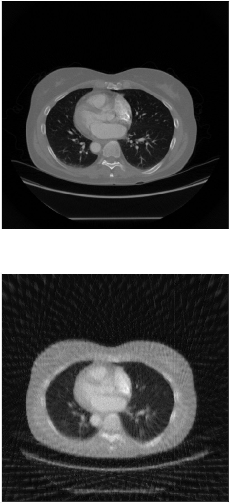

```python

```


```python
import os

import zipfile
import random
import tensorflow as tf
from tensorflow.keras.optimizers import RMSprop
from tensorflow.keras.preprocessing.image import ImageDataGenerator
from shutil import copyfile
import numpy as np

import matplotlib.pyplot as plt
import matplotlib.image as mpimg
from keras.layers import Concatenate
from keras.models import Sequential
import keras
from keras.layers import Conv2D, MaxPooling2D, Input, Dense
from keras.models import Model
import matplotlib.image as mpimg
from glob import glob
```

    Using TensorFlow backend.


```python
print(len(os.listdir('/Users/np/Desktop/tmp/sparse-v-ndct/training/sparse/')))
print(len(os.listdir('/Users/np/Desktop/tmp/sparse-v-ndct/training/ndct/')))
# 3558
# 3558
```

    3558
    3558


```python
print(len(os.listdir('/Users/np/Desktop/tmp/sparse-v-ndct/testing/sparse/')))
print(len(os.listdir('/Users/np/Desktop/tmp/sparse-v-ndct/testing/ndct/')))
# 396
# 396
```

    396
    396


```python
from glob import glob
ldct = sorted(glob( "/Users/np/Desktop/tmp/sparse-v-ndct/training/sparse/*"))
ndct = sorted(glob( "/Users/np/Desktop/tmp/sparse-v-ndct/training/ndct/*"))

ldct_test = sorted(glob( "/Users/np/Desktop/tmp/sparse-v-ndct/testing/sparse/*"))
ndct_test = sorted(glob( "/Users/np/Desktop/tmp/sparse-v-ndct/testing/ndct/*"))


```


```python


# example of horizontal shift image augmentation
from numpy import expand_dims
from keras.preprocessing.image import load_img
from keras.preprocessing.image import img_to_array
from keras.preprocessing.image import ImageDataGenerator
from matplotlib import pyplot
# load the image
ndct_imgs_train = []
#for i in range(0, len(ndct)):
for i in range(0, 2000):
     # convert to numpy array
    img = load_img(ndct[i])
    data = img_to_array(img)
    array = np.array(img)
    #print(array.shape)
    #print(data[:][0][:].shape)
      # expand dimension to one sample
    #samples = expand_dims(data, 0)
    #ndct_imgs_train.append(samples)
    ndct_imgs_train.append(data)
print(len(ndct_imgs_train))

ldct_imgs_train = []
#for i in range(0, len(ndct)):
for i in range(0, 2000):
    img = load_img(ldct[i])
      # convert to numpy array
    data = img_to_array(img)
      # expand dimension to one sample
    #samples = expand_dims(data, 0)
    ldct_imgs_train.append(data)
print(len(ldct_imgs_train))


# load the image
ndct_imgs_test = []
#for i in range(0, len(ndct_test)):
for i in range(0, 100):
    
    img = load_img(ndct_test[i])
      # convert to numpy array
    data = img_to_array(img)
    
      # expand dimension to one sample
    #samples = expand_dims(data, 0)
    ndct_imgs_test.append(data)
print(len(ndct_imgs_test))

ldct_imgs_test = []
#for i in range(0, len(ldct_test)):
for i in range(0, 100):
    img = load_img(ldct_test[i])
      # convert to numpy array
    data = img_to_array(img)
      # expand dimension to one sample
    #samples = expand_dims(data, 0)
    ldct_imgs_test.append(data)
print(len(ldct_imgs_test))


```

    2000
    2000
    100
    100


```python
k1 = np.asarray(ldct_imgs_train)
k2 = np.asarray(ndct_imgs_train)
k1 = k1[:,:,:,0]
k2 = k2[:,:,:,0]
k1 = k1.reshape(2000,512,512,1)
k2 = k2.reshape(2000,512,512,1)
print(k1.shape)
print(k2.shape)
k3 = np.asarray(ldct_imgs_test)
k4 = np.asarray(ndct_imgs_test)
k3 = k3[:,:,:,0]
k4 = k4[:,:,:,0]
k3 = k3.reshape(100,512,512,1) 
k4 = k4.reshape(100,512,512,1)
print(k3.shape)
print(k4.shape)


```

    (2000, 512, 512, 1)
    (2000, 512, 512, 1)
    (100, 512, 512, 1)
    (100, 512, 512, 1)


```python
class LossHistory(keras.callbacks.Callback):
    def on_train_begin(self, logs={}):
        self.losses = []

    def on_batch_end(self, batch, logs={}):
        self.losses.append(logs.get('loss'))
history = LossHistory()
```


```python
# https://www.kaggle.com/jesperdramsch/intro-chest-xray-dicom-viz-u-nets-full-data
from keras.layers.convolutional import Conv2DTranspose
from keras.layers import concatenate

inputs = Input((None, None,1))

c1 = Conv2D(8, (3, 3), activation='relu', padding='same') (inputs)
c1 = Conv2D(8, (3, 3), activation='relu', padding='same') (c1)
p1 = MaxPooling2D((2, 2)) (c1)

c2 = Conv2D(16, (3, 3), activation='relu', padding='same') (p1)
c2 = Conv2D(16, (3, 3), activation='relu', padding='same') (c2)
p2 = MaxPooling2D((2, 2)) (c2)

c3 = Conv2D(32, (3, 3), activation='relu', padding='same') (p2)
c3 = Conv2D(32, (3, 3), activation='relu', padding='same') (c3)
p3 = MaxPooling2D((2, 2)) (c3)

c4 = Conv2D(64, (3, 3), activation='relu', padding='same') (p3)
c4 = Conv2D(64, (3, 3), activation='relu', padding='same') (c4)
p4 = MaxPooling2D(pool_size=(2, 2)) (c4)

c5 = Conv2D(64, (3, 3), activation='relu', padding='same') (p4)
c5 = Conv2D(64, (3, 3), activation='relu', padding='same') (c5)
p5 = MaxPooling2D(pool_size=(2, 2)) (c5)

c55 = Conv2D(128, (3, 3), activation='relu', padding='same') (p5)
c55 = Conv2D(128, (3, 3), activation='relu', padding='same') (c55)

u6 = Conv2DTranspose(64, (2, 2), strides=(2, 2), padding='same') (c55)
u6 = concatenate([u6, c5])
c6 = Conv2D(64, (3, 3), activation='relu', padding='same') (u6)
c6 = Conv2D(64, (3, 3), activation='relu', padding='same') (c6)

u71 = Conv2DTranspose(32, (2, 2), strides=(2, 2), padding='same') (c6)
u71 = concatenate([u71, c4])
c71 = Conv2D(32, (3, 3), activation='relu', padding='same') (u71)
c61 = Conv2D(32, (3, 3), activation='relu', padding='same') (c71)

u7 = Conv2DTranspose(32, (2, 2), strides=(2, 2), padding='same') (c61)
u7 = concatenate([u7, c3])
c7 = Conv2D(32, (3, 3), activation='relu', padding='same') (u7)
c7 = Conv2D(32, (3, 3), activation='relu', padding='same') (c7)

u8 = Conv2DTranspose(16, (2, 2), strides=(2, 2), padding='same') (c7)
u8 = concatenate([u8, c2])
c8 = Conv2D(16, (3, 3), activation='relu', padding='same') (u8)
c8 = Conv2D(16, (3, 3), activation='relu', padding='same') (c8)

u9 = Conv2DTranspose(8, (2, 2), strides=(2, 2), padding='same') (c8)
u9 = concatenate([u9, c1], axis=3)
c9 = Conv2D(8, (3, 3), activation='relu', padding='same') (u9)
c9 = Conv2D(8, (3, 3), activation='relu', padding='same') (c9)

#output_img = Conv2D(1, (1, 1), activation='sigmoid') (c9)
output_img = Conv2D(1, (1, 1)) (c9)
subtracted = keras.layers.Subtract()([inputs, output_img])


model = Model(inputs=[inputs], outputs=[subtracted])
#model.compile(optimizer='adam', loss='binary_crossentropy', metrics=[dice_coef])
model.compile(optimizer='adam', loss='mse', metrics=['acc'])

model.summary()
```

    __________________________________________________________________________________________________
    Layer (type)                    Output Shape         Param #     Connected to                     
    ==================================================================================================
    input_4 (InputLayer)            (None, None, None, 1 0                                            
    __________________________________________________________________________________________________
    conv2d_70 (Conv2D)              (None, None, None, 8 80          input_4[0][0]                    
    __________________________________________________________________________________________________
    conv2d_71 (Conv2D)              (None, None, None, 8 584         conv2d_70[0][0]                  
    __________________________________________________________________________________________________
    max_pooling2d_16 (MaxPooling2D) (None, None, None, 8 0           conv2d_71[0][0]                  
    __________________________________________________________________________________________________
    conv2d_72 (Conv2D)              (None, None, None, 1 1168        max_pooling2d_16[0][0]           
    __________________________________________________________________________________________________
    conv2d_73 (Conv2D)              (None, None, None, 1 2320        conv2d_72[0][0]                  
    __________________________________________________________________________________________________
    max_pooling2d_17 (MaxPooling2D) (None, None, None, 1 0           conv2d_73[0][0]                  
    __________________________________________________________________________________________________
    conv2d_74 (Conv2D)              (None, None, None, 3 4640        max_pooling2d_17[0][0]           
    __________________________________________________________________________________________________
    conv2d_75 (Conv2D)              (None, None, None, 3 9248        conv2d_74[0][0]                  
    __________________________________________________________________________________________________
    max_pooling2d_18 (MaxPooling2D) (None, None, None, 3 0           conv2d_75[0][0]                  
    __________________________________________________________________________________________________
    conv2d_76 (Conv2D)              (None, None, None, 6 18496       max_pooling2d_18[0][0]           
    __________________________________________________________________________________________________
    conv2d_77 (Conv2D)              (None, None, None, 6 36928       conv2d_76[0][0]                  
    __________________________________________________________________________________________________
    max_pooling2d_19 (MaxPooling2D) (None, None, None, 6 0           conv2d_77[0][0]                  
    __________________________________________________________________________________________________
    conv2d_78 (Conv2D)              (None, None, None, 6 36928       max_pooling2d_19[0][0]           
    __________________________________________________________________________________________________
    conv2d_79 (Conv2D)              (None, None, None, 6 36928       conv2d_78[0][0]                  
    __________________________________________________________________________________________________
    max_pooling2d_20 (MaxPooling2D) (None, None, None, 6 0           conv2d_79[0][0]                  
    __________________________________________________________________________________________________
    conv2d_80 (Conv2D)              (None, None, None, 1 73856       max_pooling2d_20[0][0]           
    __________________________________________________________________________________________________
    conv2d_81 (Conv2D)              (None, None, None, 1 147584      conv2d_80[0][0]                  
    __________________________________________________________________________________________________
    conv2d_transpose_16 (Conv2DTran (None, None, None, 6 32832       conv2d_81[0][0]                  
    __________________________________________________________________________________________________
    concatenate_16 (Concatenate)    (None, None, None, 1 0           conv2d_transpose_16[0][0]        
                                                                     conv2d_79[0][0]                  
    __________________________________________________________________________________________________
    conv2d_82 (Conv2D)              (None, None, None, 6 73792       concatenate_16[0][0]             
    __________________________________________________________________________________________________
    conv2d_83 (Conv2D)              (None, None, None, 6 36928       conv2d_82[0][0]                  
    __________________________________________________________________________________________________
    conv2d_transpose_17 (Conv2DTran (None, None, None, 3 8224        conv2d_83[0][0]                  
    __________________________________________________________________________________________________
    concatenate_17 (Concatenate)    (None, None, None, 9 0           conv2d_transpose_17[0][0]        
                                                                     conv2d_77[0][0]                  
    __________________________________________________________________________________________________
    conv2d_84 (Conv2D)              (None, None, None, 3 27680       concatenate_17[0][0]             
    __________________________________________________________________________________________________
    conv2d_85 (Conv2D)              (None, None, None, 3 9248        conv2d_84[0][0]                  
    __________________________________________________________________________________________________
    conv2d_transpose_18 (Conv2DTran (None, None, None, 3 4128        conv2d_85[0][0]                  
    __________________________________________________________________________________________________
    concatenate_18 (Concatenate)    (None, None, None, 6 0           conv2d_transpose_18[0][0]        
                                                                     conv2d_75[0][0]                  
    __________________________________________________________________________________________________
    conv2d_86 (Conv2D)              (None, None, None, 3 18464       concatenate_18[0][0]             
    __________________________________________________________________________________________________
    conv2d_87 (Conv2D)              (None, None, None, 3 9248        conv2d_86[0][0]                  
    __________________________________________________________________________________________________
    conv2d_transpose_19 (Conv2DTran (None, None, None, 1 2064        conv2d_87[0][0]                  
    __________________________________________________________________________________________________
    concatenate_19 (Concatenate)    (None, None, None, 3 0           conv2d_transpose_19[0][0]        
                                                                     conv2d_73[0][0]                  
    __________________________________________________________________________________________________
    conv2d_88 (Conv2D)              (None, None, None, 1 4624        concatenate_19[0][0]             
    __________________________________________________________________________________________________
    conv2d_89 (Conv2D)              (None, None, None, 1 2320        conv2d_88[0][0]                  
    __________________________________________________________________________________________________
    conv2d_transpose_20 (Conv2DTran (None, None, None, 8 520         conv2d_89[0][0]                  
    __________________________________________________________________________________________________
    concatenate_20 (Concatenate)    (None, None, None, 1 0           conv2d_transpose_20[0][0]        
                                                                     conv2d_71[0][0]                  
    __________________________________________________________________________________________________
    conv2d_90 (Conv2D)              (None, None, None, 8 1160        concatenate_20[0][0]             
    __________________________________________________________________________________________________
    conv2d_91 (Conv2D)              (None, None, None, 8 584         conv2d_90[0][0]                  
    __________________________________________________________________________________________________
    conv2d_92 (Conv2D)              (None, None, None, 1 9           conv2d_91[0][0]                  
    __________________________________________________________________________________________________
    subtract_4 (Subtract)           (None, None, None, 1 0           input_4[0][0]                    
                                                                     conv2d_92[0][0]                  
    ==================================================================================================
    Total params: 600,585
    Trainable params: 600,585
    Non-trainable params: 0
    __________________________________________________________________________________________________


```python
model.fit(k1, k2, validation_split=.2, batch_size=32, epochs=1,callbacks=[history])

```

    Train on 1600 samples, validate on 400 samples
    Epoch 1/1
    1600/1600 [==============================] - 1319s 825ms/step - loss: 238.9575 - acc: 0.0737 - val_loss: 225.8016 - val_acc: 0.0569


    <keras.callbacks.History at 0xce8f7d278>


```python
print(history.losses)
```

    [285.0828, 313.89728, 282.11172, 281.31946, 287.4636, 279.47202, 273.5864, 284.30072, 301.30127, 285.78912, 273.5733, 259.36148, 322.7558, 305.76187, 227.94968, 294.96173, 238.37247, 290.27716, 244.46033, 236.27097, 245.32678, 240.87038, 292.16522, 204.06598, 221.90594, 250.90765, 225.7361, 259.1752, 216.98413, 205.66028, 191.19537, 196.64139, 213.6114, 228.39348, 204.00172, 246.73099, 283.60577, 162.09079, 196.30896, 173.47028, 177.55527, 240.99364, 145.80585, 174.79733, 200.45058, 183.32, 172.8968, 228.05698, 190.45963, 206.62006]


```python
model.evaluate(k3, k4)
```

    100/100 [==============================] - 19s 189ms/step


    [178.09837646484374, 0.06676002502441407]


```python
for layer in model.layers:
    print(layer.output_shape)
```

    (None, None, None, 1)
    (None, None, None, 8)
    (None, None, None, 8)
    (None, None, None, 8)
    (None, None, None, 16)
    (None, None, None, 16)
    (None, None, None, 16)
    (None, None, None, 32)
    (None, None, None, 32)
    (None, None, None, 32)
    (None, None, None, 64)
    (None, None, None, 64)
    (None, None, None, 64)
    (None, None, None, 64)
    (None, None, None, 64)
    (None, None, None, 64)
    (None, None, None, 128)
    (None, None, None, 128)
    (None, None, None, 64)
    (None, None, None, 128)
    (None, None, None, 64)
    (None, None, None, 64)
    (None, None, None, 32)
    (None, None, None, 96)
    (None, None, None, 32)
    (None, None, None, 32)
    (None, None, None, 32)
    (None, None, None, 64)
    (None, None, None, 32)
    (None, None, None, 32)
    (None, None, None, 16)
    (None, None, None, 32)
    (None, None, None, 16)
    (None, None, None, 16)
    (None, None, None, 8)
    (None, None, None, 16)
    (None, None, None, 8)
    (None, None, None, 8)
    (None, None, None, 1)
    (None, None, None, 1)


```python
model.summary()
```

    __________________________________________________________________________________________________
    Layer (type)                    Output Shape         Param #     Connected to                     
    ==================================================================================================
    input_4 (InputLayer)            (None, None, None, 1 0                                            
    __________________________________________________________________________________________________
    conv2d_70 (Conv2D)              (None, None, None, 8 80          input_4[0][0]                    
    __________________________________________________________________________________________________
    conv2d_71 (Conv2D)              (None, None, None, 8 584         conv2d_70[0][0]                  
    __________________________________________________________________________________________________
    max_pooling2d_16 (MaxPooling2D) (None, None, None, 8 0           conv2d_71[0][0]                  
    __________________________________________________________________________________________________
    conv2d_72 (Conv2D)              (None, None, None, 1 1168        max_pooling2d_16[0][0]           
    __________________________________________________________________________________________________
    conv2d_73 (Conv2D)              (None, None, None, 1 2320        conv2d_72[0][0]                  
    __________________________________________________________________________________________________
    max_pooling2d_17 (MaxPooling2D) (None, None, None, 1 0           conv2d_73[0][0]                  
    __________________________________________________________________________________________________
    conv2d_74 (Conv2D)              (None, None, None, 3 4640        max_pooling2d_17[0][0]           
    __________________________________________________________________________________________________
    conv2d_75 (Conv2D)              (None, None, None, 3 9248        conv2d_74[0][0]                  
    __________________________________________________________________________________________________
    max_pooling2d_18 (MaxPooling2D) (None, None, None, 3 0           conv2d_75[0][0]                  
    __________________________________________________________________________________________________
    conv2d_76 (Conv2D)              (None, None, None, 6 18496       max_pooling2d_18[0][0]           
    __________________________________________________________________________________________________
    conv2d_77 (Conv2D)              (None, None, None, 6 36928       conv2d_76[0][0]                  
    __________________________________________________________________________________________________
    max_pooling2d_19 (MaxPooling2D) (None, None, None, 6 0           conv2d_77[0][0]                  
    __________________________________________________________________________________________________
    conv2d_78 (Conv2D)              (None, None, None, 6 36928       max_pooling2d_19[0][0]           
    __________________________________________________________________________________________________
    conv2d_79 (Conv2D)              (None, None, None, 6 36928       conv2d_78[0][0]                  
    __________________________________________________________________________________________________
    max_pooling2d_20 (MaxPooling2D) (None, None, None, 6 0           conv2d_79[0][0]                  
    __________________________________________________________________________________________________
    conv2d_80 (Conv2D)              (None, None, None, 1 73856       max_pooling2d_20[0][0]           
    __________________________________________________________________________________________________
    conv2d_81 (Conv2D)              (None, None, None, 1 147584      conv2d_80[0][0]                  
    __________________________________________________________________________________________________
    conv2d_transpose_16 (Conv2DTran (None, None, None, 6 32832       conv2d_81[0][0]                  
    __________________________________________________________________________________________________
    concatenate_16 (Concatenate)    (None, None, None, 1 0           conv2d_transpose_16[0][0]        
                                                                     conv2d_79[0][0]                  
    __________________________________________________________________________________________________
    conv2d_82 (Conv2D)              (None, None, None, 6 73792       concatenate_16[0][0]             
    __________________________________________________________________________________________________
    conv2d_83 (Conv2D)              (None, None, None, 6 36928       conv2d_82[0][0]                  
    __________________________________________________________________________________________________
    conv2d_transpose_17 (Conv2DTran (None, None, None, 3 8224        conv2d_83[0][0]                  
    __________________________________________________________________________________________________
    concatenate_17 (Concatenate)    (None, None, None, 9 0           conv2d_transpose_17[0][0]        
                                                                     conv2d_77[0][0]                  
    __________________________________________________________________________________________________
    conv2d_84 (Conv2D)              (None, None, None, 3 27680       concatenate_17[0][0]             
    __________________________________________________________________________________________________
    conv2d_85 (Conv2D)              (None, None, None, 3 9248        conv2d_84[0][0]                  
    __________________________________________________________________________________________________
    conv2d_transpose_18 (Conv2DTran (None, None, None, 3 4128        conv2d_85[0][0]                  
    __________________________________________________________________________________________________
    concatenate_18 (Concatenate)    (None, None, None, 6 0           conv2d_transpose_18[0][0]        
                                                                     conv2d_75[0][0]                  
    __________________________________________________________________________________________________
    conv2d_86 (Conv2D)              (None, None, None, 3 18464       concatenate_18[0][0]             
    __________________________________________________________________________________________________
    conv2d_87 (Conv2D)              (None, None, None, 3 9248        conv2d_86[0][0]                  
    __________________________________________________________________________________________________
    conv2d_transpose_19 (Conv2DTran (None, None, None, 1 2064        conv2d_87[0][0]                  
    __________________________________________________________________________________________________
    concatenate_19 (Concatenate)    (None, None, None, 3 0           conv2d_transpose_19[0][0]        
                                                                     conv2d_73[0][0]                  
    __________________________________________________________________________________________________
    conv2d_88 (Conv2D)              (None, None, None, 1 4624        concatenate_19[0][0]             
    __________________________________________________________________________________________________
    conv2d_89 (Conv2D)              (None, None, None, 1 2320        conv2d_88[0][0]                  
    __________________________________________________________________________________________________
    conv2d_transpose_20 (Conv2DTran (None, None, None, 8 520         conv2d_89[0][0]                  
    __________________________________________________________________________________________________
    concatenate_20 (Concatenate)    (None, None, None, 1 0           conv2d_transpose_20[0][0]        
                                                                     conv2d_71[0][0]                  
    __________________________________________________________________________________________________
    conv2d_90 (Conv2D)              (None, None, None, 8 1160        concatenate_20[0][0]             
    __________________________________________________________________________________________________
    conv2d_91 (Conv2D)              (None, None, None, 8 584         conv2d_90[0][0]                  
    __________________________________________________________________________________________________
    conv2d_92 (Conv2D)              (None, None, None, 1 9           conv2d_91[0][0]                  
    __________________________________________________________________________________________________
    subtract_4 (Subtract)           (None, None, None, 1 0           input_4[0][0]                    
                                                                     conv2d_92[0][0]                  
    ==================================================================================================
    Total params: 600,585
    Trainable params: 600,585
    Non-trainable params: 0
    __________________________________________________________________________________________________


```python
reconstructed = model.predict(k3)
mse = ((k4.astype(np.float) - reconstructed.astype(np.float)) ** 2).mean()
psnr = 10 * np.log10(255 ** 2 / mse)
print(psnr)
```

    25.62420395416092


```python
n = 1
plt.figure(figsize=(30, 30))

images = model.predict(k3)

for i in range(n):
    # plot original image
    ax = plt.subplot(3, n, i + 1)
    plt.imshow(k4[i].reshape(512, 512))
    plt.gray()
    ax.get_xaxis().set_visible(False)
    ax.get_yaxis().set_visible(False)
    if i == n/2:
        ax.set_title('Original Images')

    # plot noisy image 
    ax = plt.subplot(3, n, i + 1 + n)
    plt.imshow(k3[i].reshape(512, 512))
    plt.gray()
    ax.get_xaxis().set_visible(False)
    ax.get_yaxis().set_visible(False)
    if i == n/2:
        ax.set_title('Noisy Input')
        
    # plot noisy image 
    ax = plt.subplot(3, n, i + 1 + 2*n)
    plt.imshow(images[i].reshape(512, 512))

    plt.gray()
    ax.get_xaxis().set_visible(False)
    ax.get_yaxis().set_visible(False)
    if i == n/2:
        ax.set_title('Autoencoder Output')
```


```python
# import matplotlib.pyplot as plt
# acc = history.history['acc']
# val_acc = history.history['val_acc']
# loss = history.history['loss']
# val_loss = history.history['val_loss']

# epochs = range(len(acc))

# plt.plot(epochs, acc, 'r', label='Training accuracy')
# plt.plot(epochs, val_acc, 'b', label='Validation accuracy')
# plt.title('Training and validation accuracy')
# plt.legend()
# plt.figure()

# plt.plot(epochs, loss, 'r', label='Training Loss')
# plt.plot(epochs, val_loss, 'b', label='Validation Loss')
# plt.title('Training and validation loss')
# plt.legend()

# plt.show()
```


```python
def plot_autoencoder_outputs(autoencoder, n, dims):
    decoded_imgs = autoencoder.predict(k3)

    # number of example digits to show
    #n = 5
    plt.figure(figsize=(100, 40.5))
    for i in range(n):
        # plot original image
        ax = plt.subplot(2, n, i + 1)
        plt.imshow(k4[i].reshape(*dims))
        plt.gray()
        ax.get_xaxis().set_visible(False)
        ax.get_yaxis().set_visible(False)
        if i == n/2:
            ax.set_title('Original Images')

        # plot reconstruction 
        ax = plt.subplot(2, n, i + 1 + n)
        plt.imshow(decoded_imgs[i].reshape(*dims))
        plt.gray()
        ax.get_xaxis().set_visible(False)
        ax.get_yaxis().set_visible(False)
        if i == n/2:
            ax.set_title('Reconstructed Images')
    plt.show()
```


```python
plot_autoencoder_outputs(model, 1, (512, 512))


```





```python
plot_autoencoder_outputs(model, 2, (512, 512))


```


```python

```
